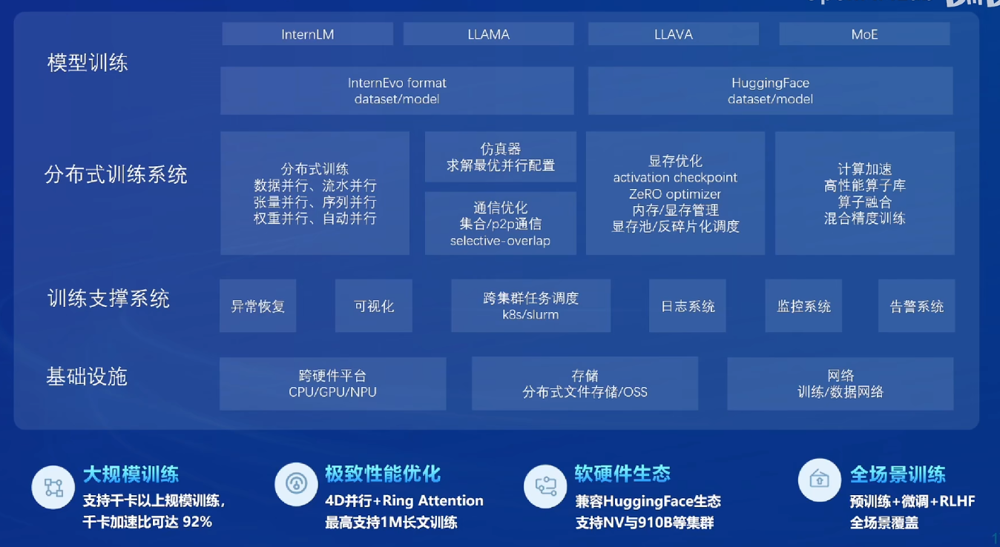
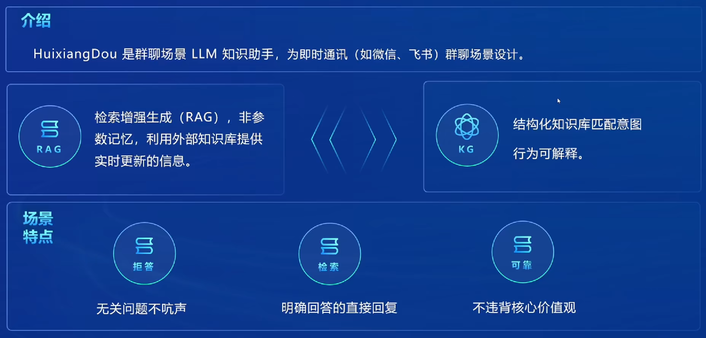

# 书生大模型全链路开源体系

## 一、书生·浦语大模型开源开放体系介绍

- 汪周谦老师介绍了书生葡语大模型开源开放体系，强调这是一个全面的课程，旨在帮助学生快速了解书生·浦语这个IP。

- 课程内容包括人文课程，帮助学生了解书生·浦语的历史和发展，同时也介绍最近半年的新进展。

## 二、书生·浦语的开源之路

- 从2023年7月6日开始，书生·浦语的大模型率先免费开源，并发布了全链条的开源工具体系。

- 2023年9月底，发布了InternLM-20B的重量级模型，适合中小企业和科研机构使用。

- 2024年1月，发布了InternLM2，其性能超越了同量级的开源模型，达到了7B甚至70B的性能水平。

- 2024年7月初，发布了InternLM2.5，性能获得了质的飞跃。

## 三、书生·浦语2.5的性能特点

- 书生·浦语2.5在推理能力、上下文记忆和自主规划等方面都有显著提升。

- 推理能力方面，书生·浦语2.5的推理性能比上一代提升了20%，达到了领先水平。

- 上下文记忆方面，书生·浦语2.5的上下文记忆达到了100万级别，超过了GPT4o的128K级别。

- 自主规划和搜索方面，书生·浦语2.5具有完成复杂任务的能力，能够解锁复杂任务。

## 四、书生·浦语开源体系的核心思想和技术路线

- 书生·浦语开源体系的核心思想是不断反馈，通过不断优化数据和模型，提高性能。

- 数据驱动和数据质量驱动是书生·浦语开源体系的关键，高质量的合成数据是通过规则构造、模型扩充和反馈生成等方式实现的。

- 书生·浦语开源社区还提供了Label LLM开源项目，方便用户对NLP任务进行标注。

## 五、书生·浦语2.5的推理能力

- 书生·浦语2.5在推理能力方面表现出色，即使是在没有进行太多提示词工程的情况下，也能准确回答问题。

- 书生·浦语2.5的推理能力在大海捞针实验中表现优异，能够在超长背景知识中准确定位任何位置的信息。
- 书生·浦语2.5的推理能力在实际应用中表现出色，能够处理复杂的文本分析和问题回答任务。

## 六、书生·浦语2.5原生支持超长上下文的功能

- 原生支持超长上下文的功能是未来能够替代RAG的方向之一。

- 在一些更通用的场景下，原生可以替代RAG。

- 基于规划和搜索解决复杂问题的能力也是原生的重要优势。

## 七、Mind Search项目基础介绍

- Mind Search项目是一个基于网页浏览的项目。

- Mind Search的体验非常好，熟悉后日常的调研和搜索工作都会离不开它。

## 八、书生·浦语开源模型谱系

- 书生·浦语开源模型谱系包括1.8B参数的模型、7B参数的模型和20亿参数的模型。

- 1.8B参数的模型可以在端侧运行，如手机和边缘设备；7B参数的模型适用于轻量级研究和应用；20B参数的模型则在生产环境中表现出色。

- 20B参数的模型出现了“涌现”现象，即能够回答未见过的东西。

## 九、书生·浦语全链条开源生态

- 书生·浦语全链条开源生态包括数据、预训练、微调、部署、评测和应用的全链路。

- 所有的工具都开源了，实现了方案的透明化。

- 书生·万卷是一个开源的预训练语料库，个人用户和企业用户都可以使用。

## 十、预训练框架和微调框架

- 预训练框架主要是进行显存优化、分布式训练和分布式训练之间的通信优化。

- 微调框架XTUNER支持市面上各种其他厂牌的开源模型，包括增量预训练、指令微调、多模态微调和对齐。

- XTUNER框架的数据格式兼容一些已经开源的数据格式。

- 开源数据集的格式通常需要转化为统一的格式，以便于使用。

- 自定义数据集可以直接按照统一的格式进行制作。

- 这种格式转换工作对于使用开源数据集非常重要。

- 优化加速使用了flash attention技术，该技术无需手动设置即可开启。

- 除此之外，还使用了deepspeed zero、Pytorch FSDP、sequence parallel等优化加速方式。

- 支持的主要算法有两种：QLoRA的微调和LoRA的微调。

- 这两种方法是目前科研和企业产品中使用最广泛的微调方法。

- 全量参数微调也支持，但需要在强大的计算设备上进行。

## 十一、XTuner的微调效果

- 使用XTuner的微调框架可以运行原先无法运行的大参数模型。

- 显存管理是XTuner的一个优势，可以有效回收显存，避免在反向传播过程中浪费显存。

## 十二、OpenCompass评测体系

- OpenCompass评测体系广泛应用于头部大模型企业和科研机构，是唯一获得Meta官方推荐的国产大模型评测体系。

## 十三、LMDeploy部署框架

- LMDeploy部署框架支持多种开源模型和国产大模型的推理接口。

- 推理接口包括PYTHON、RESTFUL、gRPC，量化引擎包括基于权重的量化和KV Cache。

- 服务方面支持类OpenAI的服务和Gradio、Triton推理服务。

## 十四、智能体框架Legent

- Legent框架支持多种大语言模型，包括本地的InternLM和GPT。

- Legend框架能够可视化展示模型的思维路径和结果，增强了用户体验。

## 十五、Mind Search智能体

- Mind Search智能体是一个基于AI和搜索结果的搜索引擎。

- 可以通过可视化的方式展示搜索过程和结果。

- 设计理念独特，能够模拟人脑的思维逻辑，提供详细的搜索路径和最终报告。

## 十六、茴香豆企业级知识库构建工具

- 茴香豆工具支持检索增强生成（RAG）、知识图谱（KG）和可解释行为。

- 工具开源免费商用，已经构建了1500多个知识库和500多个用户群。

- 支持七种文档格式更新，无需重新部署，扩展性强。

**The End.**