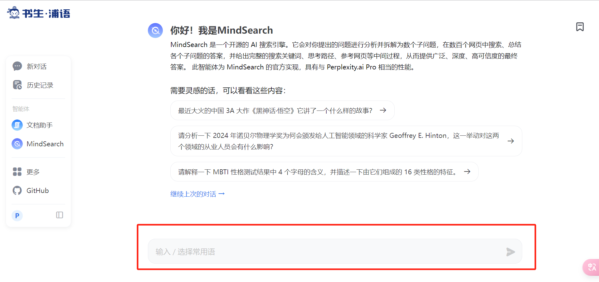
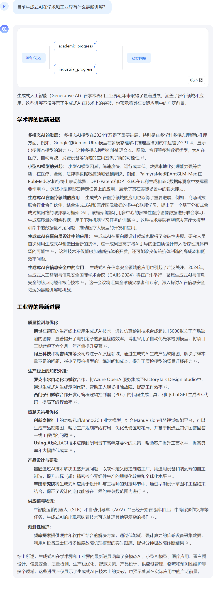

# 一、[MindSearch](https://internlm-chat.intern-ai.org.cn/suggestion/oVmlpR34V9U6v9KBQ1TN7IpPQh1Z89ONciSGUKmgFFA=)

> 任务描述：
>
> 使用 MindSearch 在以下三个问题中选择一个你感兴趣的进行提问
>
> 1. 目前生成式AI在学术和工业界有什么最新进展？
> 2. 2024 年诺贝尔物理学奖为何会颁发给人工智能领域的科学家 Geoffrey E. Hinton，这一举动对这两个领域的从业人员会有什么影响？
> 3. 最近大火的中国 3A 大作《黑神话·悟空》里有什么让你难忘的精彩故事情节？
>
> **任务要求**：将模型回复截图保存提交到飞书问卷。

## 1.访问MindSearch

https://internlm-chat.intern-ai.org.cn/suggestion/oVmlpR34V9U6v9KBQ1TN7IpPQh1Z89ONciSGUKmgFFA=

## 2.输入需要提问的问题

## 3.`目前生成式AI在学术和工业界有什么最新进展？`

## 4.`2024 年诺贝尔物理学奖为何会颁发给人工智能领域的科学家 Geoffrey E. Hinton，这一举动对这两个领域的从业人员会有什么影响？`

## 5.`最近大火的中国 3A 大作《黑神话·悟空》里有什么让你难忘的精彩故事情节？`

# 二、[书生·浦语](https://internlm-chat.intern-ai.org.cn/)

> 任务描述：
>
> 选择逻代码编程、文章创作、灵感创意、角色扮演、语言翻译、逻辑推理以上任意一个场景或者你自己感兴趣的话题与浦语进行对话 (轮次不限)。
> **任务要求**：截图保存对话内容并提交到飞书问卷。

## 1.访问[书生·浦语](https://internlm-chat.intern-ai.org.cn/)

## 2.在对话框中输入问题并多轮对话

# 三、[书生·万象](https://internvl.opengvlab.com/)

> 任务描述：
>
> 体验书生·万象模型多模态能力，从图片 OCR、图片内容理解等方面与书生·万象展开一次包含图片内容的对话
> **任务要求**：截图保存对话内容并提交到飞书问卷。

## 1.访问[书生·万象](https://internvl.opengvlab.com/)

## 2.根据图片进行提问

# 四、MindSearch 话题挑战

> 任务描述：
>
> 浦语小助手将基础任务中的三个问题在知乎上进行了提问。
>
> 1. [目前生成式AI在学术和工业界有什么最新进展？](https://www.zhihu.com/question/1841339763)
> 2. [2024 年诺贝尔物理学奖为何会颁发给人工智能领域，这一举动对这两个领域的从业人员会有什么影响？](https://www.zhihu.com/question/1915470960)
> 3. [最近大火的中国 3A 大作《黑神话·悟空》里有什么让你难忘的精彩故事情节？](https://www.zhihu.com/question/1915582405)
>
> 请以 MindSearch 的回复作为参考 (推荐) 或者直接粘贴 MindSearch 的回复内容在知乎上回答 3 个问题的任意一个。
>
> - 达标要求
>
> 1. 注明回答中使用了 AI 搜索引擎 MindSearch (任何方式注明均可，比如“以下答案参考 AI 搜索引擎 [MindSearch](https://github.com/InternLM/Tutorial/blob/camp4/docs/L1/InternIntro/需附带链接)”)
> 2. 将你在知乎回复的答案链接提交到飞书问卷

## 1.[目前生成式AI在学术和工业界有什么最新进展？](https://www.zhihu.com/question/1841339763/answer/27918560648)

## 2.[2024 年诺贝尔物理学奖为何会颁发给人工智能领域，这一举动对这两个领域的从业人员会有什么影响？](https://www.zhihu.com/question/1915470960/answer/27917200964)

## 3.[最近大火的中国 3A 大作《黑神话·悟空》里有什么让你难忘的精彩故事情节？](https://www.zhihu.com/question/1915582405/answer/27915672459)

**The End.**