# 一、LlamaIndex+InternLM API 实践

> **任务要求**：基于 LlamaIndex 构建自己的 RAG 知识库，寻找一个问题 A 在使用 LlamaIndex 之前 浦语 API 不会回答，借助 LlamaIndex 后 浦语 API 具备回答 A 的能力，截图保存。

## 1.创建新的conda环境，命名为 `llamaindex`

```bash
conda create -n llamaindex python=3.10
```

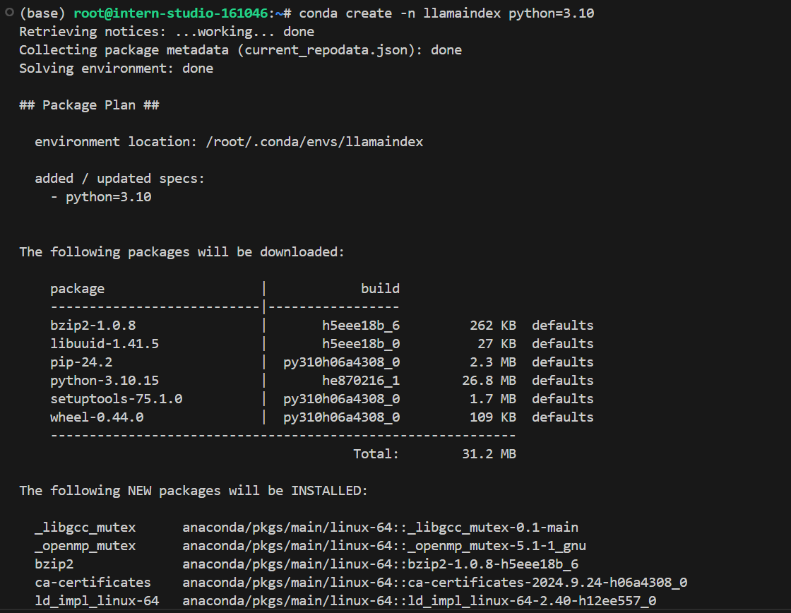

## 2.激活 `llamaindex` 

```bash
conda activate llamaindex
```

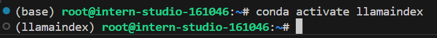

## 3.安装相关基础依赖 **python** 虚拟环境

```bash
pip install einops==0.7.0 protobuf==5.26.1
```

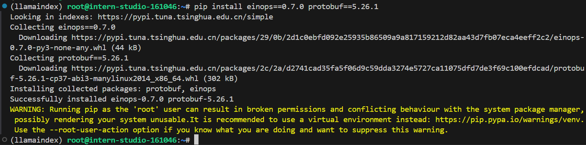

## 4.安装 Llamaindex

```bash
pip install llama-index==0.11.20
pip install llama-index-llms-replicate==0.3.0
pip install llama-index-llms-openai-like==0.2.0
pip install llama-index-embeddings-huggingface==0.3.1
pip install llama-index-embeddings-instructor==0.2.1
pip install torch==2.5.0 torchvision==0.20.0 torchaudio==2.5.0 --index-url https://download.pytorch.org/whl/cu121
```

> 此处没图……ps.这些个包安装起来好慢……

## 5.下载词向量模型`Sentence Transformer`

```bash
cd ~
mkdir llamaindex_demo
mkdir model
cd ~/llamaindex_demo
touch download_hf.py
```

编辑`download_hf.py`代码

```python
import os

# 设置环境变量
os.environ['HF_ENDPOINT'] = 'https://hf-mirror.com'

# 下载模型
os.system('huggingface-cli download --resume-download sentence-transformers/paraphrase-multilingual-MiniLM-L12-v2 --local-dir /root/model/sentence-transformer')
```

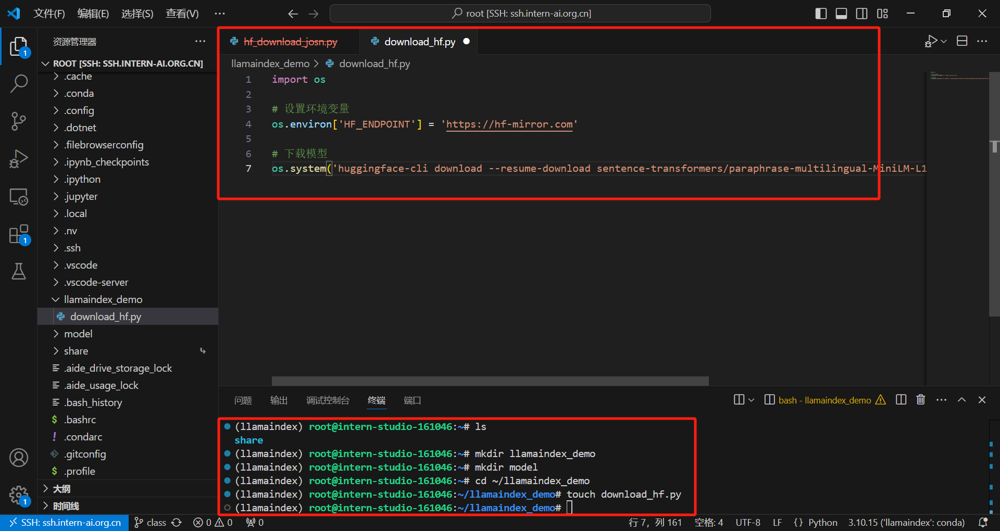

运行`download_hf.py`下载模型

```python
python download_hf.py
```

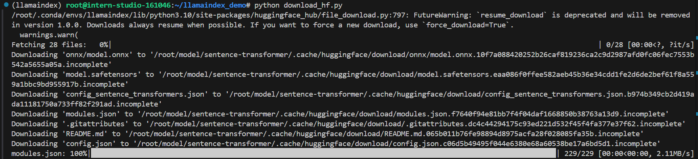

## 6.下载 NLTK 相关资源

```bash
cd /root
git clone https://gitee.com/yzy0612/nltk_data.git  --branch gh-pages
cd nltk_data
mv packages/*  ./
cd tokenizers
unzip punkt.zip
cd ../taggers
unzip averaged_perceptron_tagger.zip
```

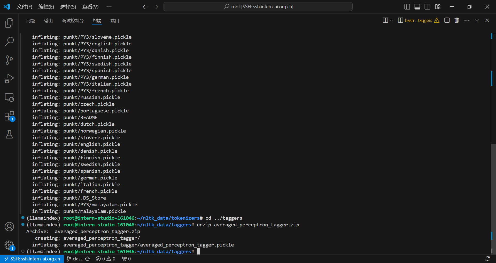

## 7.是否使用 LlamaIndex 前后对比

### 不使用 LlamaIndex RAG（仅API）

新建`test_internlm.py`文件，并编辑代码

```bash
cd ~/llamaindex_demo
touch test_internlm.py
```

```python
from openai import OpenAI

base_url = "https://internlm-chat.intern-ai.org.cn/puyu/api/v1/"
api_key = "xxxxxxxxxxxxxxxxxxxx"
model="internlm2.5-latest"

# base_url = "https://api.siliconflow.cn/v1"
# api_key = "sk-请填写准确的 token！"
# model="internlm/internlm2_5-7b-chat"

client = OpenAI(
    api_key=api_key , 
    base_url=base_url,
)

chat_rsp = client.chat.completions.create(
    model=model,
    messages=[{"role": "user", "content": "Jim.Fan是谁？"}],
)

for choice in chat_rsp.choices:
    print(choice.message.content)
```

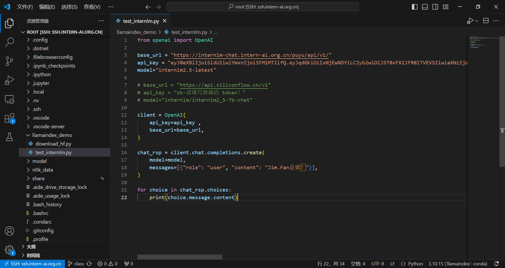

运行`test_internlm.py`查看结果

```bash
python test_internlm.py
```

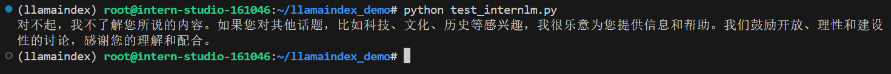

### 使用 API+LlamaIndex

获取知识库

```bash
cd ~/llamaindex_demo
mkdir data
cd data
git clone https://github.com/gcfan0813/InternLM-Study.git
mv InternLM-Study/README.md ./ 
```

新建`llamaindex_RAG.py`并编辑代码

```bash
cd ~/llamaindex_demo
touch llamaindex_RAG.py
```

```python
import os 
os.environ['NLTK_DATA'] = '/root/nltk_data'

from llama_index.core import VectorStoreIndex, SimpleDirectoryReader
from llama_index.core.settings import Settings
from llama_index.embeddings.huggingface import HuggingFaceEmbedding
from llama_index.legacy.callbacks import CallbackManager
from llama_index.llms.openai_like import OpenAILike


# Create an instance of CallbackManager
callback_manager = CallbackManager()

api_base_url =  "https://internlm-chat.intern-ai.org.cn/puyu/api/v1/"
model = "internlm2.5-latest"
api_key = "xxxxxxxxxxxx"

# api_base_url =  "https://api.siliconflow.cn/v1"
# model = "internlm/internlm2_5-7b-chat"
# api_key = "请填写 API Key"


llm =OpenAILike(model=model, api_base=api_base_url, api_key=api_key, is_chat_model=True,callback_manager=callback_manager)


#初始化一个HuggingFaceEmbedding对象，用于将文本转换为向量表示
embed_model = HuggingFaceEmbedding(
#指定了一个预训练的sentence-transformer模型的路径
    model_name="/root/model/sentence-transformer"
)
#将创建的嵌入模型赋值给全局设置的embed_model属性，
#这样在后续的索引构建过程中就会使用这个模型。
Settings.embed_model = embed_model

#初始化llm
Settings.llm = llm

#从指定目录读取所有文档，并加载数据到内存中
documents = SimpleDirectoryReader("/root/llamaindex_demo/data").load_data()
#创建一个VectorStoreIndex，并使用之前加载的文档来构建索引。
# 此索引将文档转换为向量，并存储这些向量以便于快速检索。
index = VectorStoreIndex.from_documents(documents)
# 创建一个查询引擎，这个引擎可以接收查询并返回相关文档的响应。
query_engine = index.as_query_engine()
response = query_engine.query("Jim.Fan是谁？")

print(response)
```

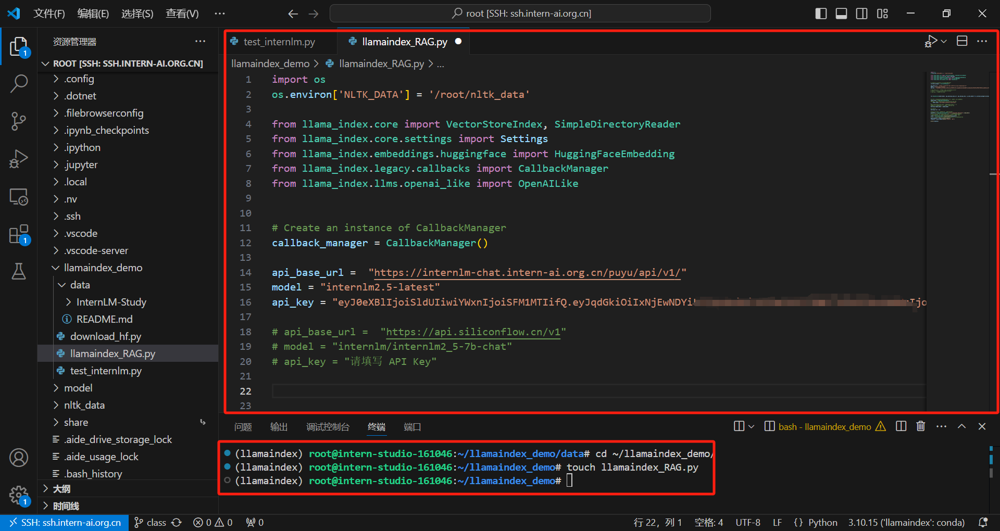

运行`llamaindex_RAG.py`并查看结果

```bash
cd ~/llamaindex_demo/
python llamaindex_RAG.py
```

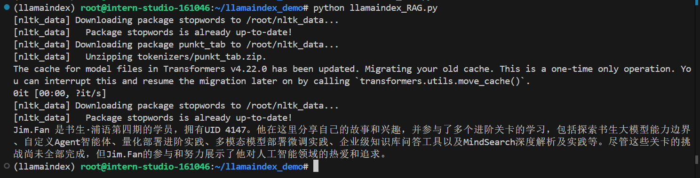

## 8.LlamaIndex web

安装依赖

```bash
pip install streamlit==1.39.0
```

新建`app.py`并填入代码

```bash
cd ~/llamaindex_demo
touch app.py
```

```python
import streamlit as st
from llama_index.core import VectorStoreIndex, SimpleDirectoryReader, Settings
from llama_index.embeddings.huggingface import HuggingFaceEmbedding
from llama_index.legacy.callbacks import CallbackManager
from llama_index.llms.openai_like import OpenAILike

# Create an instance of CallbackManager
callback_manager = CallbackManager()

api_base_url =  "https://internlm-chat.intern-ai.org.cn/puyu/api/v1/"
model = "internlm2.5-latest"
api_key = "xxxxxxxxxxxx"

# api_base_url =  "https://api.siliconflow.cn/v1"
# model = "internlm/internlm2_5-7b-chat"
# api_key = "请填写 API Key"

llm =OpenAILike(model=model, api_base=api_base_url, api_key=api_key, is_chat_model=True,callback_manager=callback_manager)


st.set_page_config(page_title="llama_index_demo", page_icon="🦜🔗")
st.title("llama_index_demo")

# 初始化模型
@st.cache_resource
def init_models():
    embed_model = HuggingFaceEmbedding(
        model_name="/root/model/sentence-transformer"
    )
    Settings.embed_model = embed_model

    #用初始化llm
    Settings.llm = llm

    documents = SimpleDirectoryReader("/root/llamaindex_demo/data").load_data()
    index = VectorStoreIndex.from_documents(documents)
    query_engine = index.as_query_engine()

    return query_engine

# 检查是否需要初始化模型
if 'query_engine' not in st.session_state:
    st.session_state['query_engine'] = init_models()

def greet2(question):
    response = st.session_state['query_engine'].query(question)
    return response

      
# Store LLM generated responses
if "messages" not in st.session_state.keys():
    st.session_state.messages = [{"role": "assistant", "content": "你好，我是你的助手，有什么我可以帮助你的吗？"}]    

    # Display or clear chat messages
for message in st.session_state.messages:
    with st.chat_message(message["role"]):
        st.write(message["content"])

def clear_chat_history():
    st.session_state.messages = [{"role": "assistant", "content": "你好，我是你的助手，有什么我可以帮助你的吗？"}]

st.sidebar.button('Clear Chat History', on_click=clear_chat_history)

# Function for generating LLaMA2 response
def generate_llama_index_response(prompt_input):
    return greet2(prompt_input)

# User-provided prompt
if prompt := st.chat_input():
    st.session_state.messages.append({"role": "user", "content": prompt})
    with st.chat_message("user"):
        st.write(prompt)

# Gegenerate_llama_index_response last message is not from assistant
if st.session_state.messages[-1]["role"] != "assistant":
    with st.chat_message("assistant"):
        with st.spinner("Thinking..."):
            response = generate_llama_index_response(prompt)
            placeholder = st.empty()
            placeholder.markdown(response)
    message = {"role": "assistant", "content": response}
    st.session_state.messages.append(message)
```

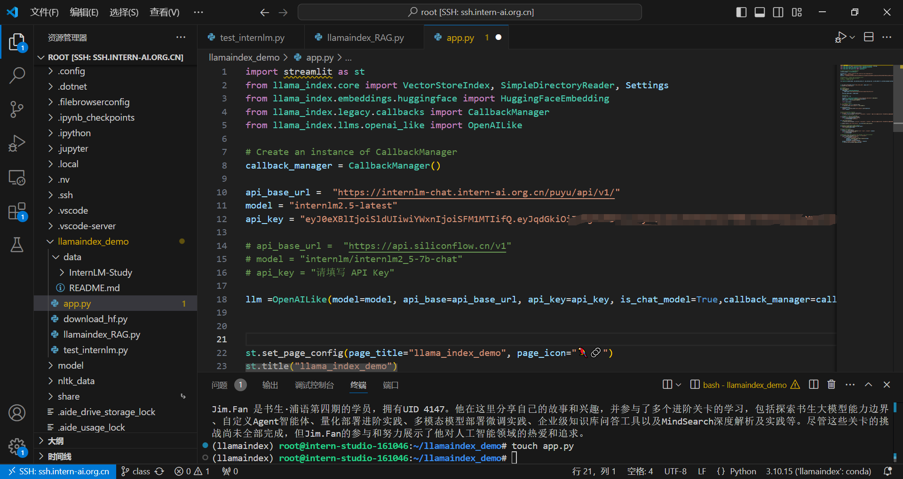

运行`app.py`

```bash
streamlit run app.py
```

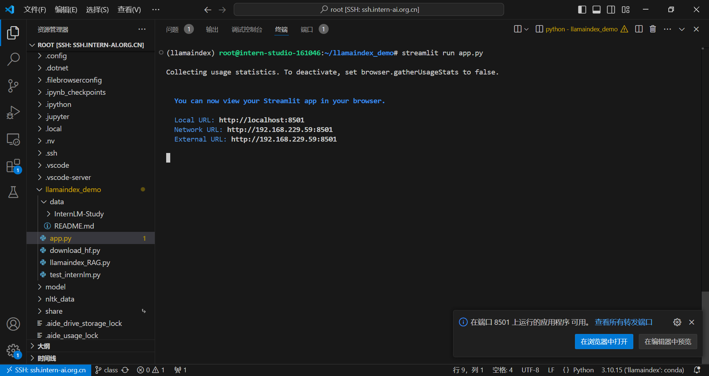

浏览器访问`http://localhost:8501/`

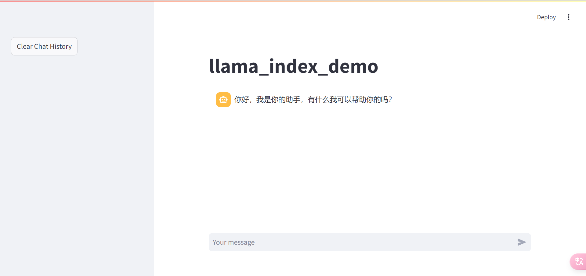

提个问`Jim.Fan是谁？`

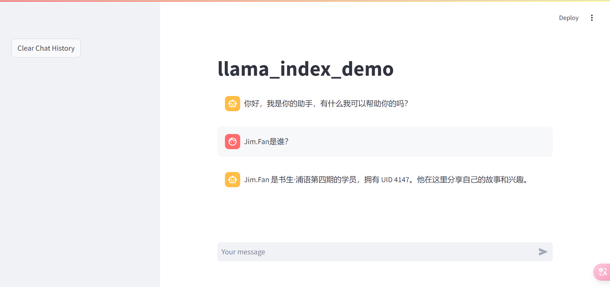


# 二、将 Streamlit+LlamaIndex+浦语API的 Space 部署到 Hugging Face

## 1.新建Hugging Face Space

[Hugging Face Space](https://huggingface.co/spaces)

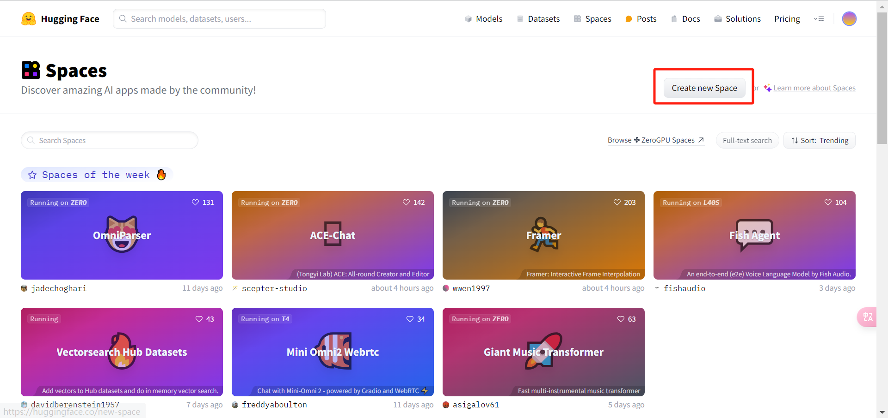

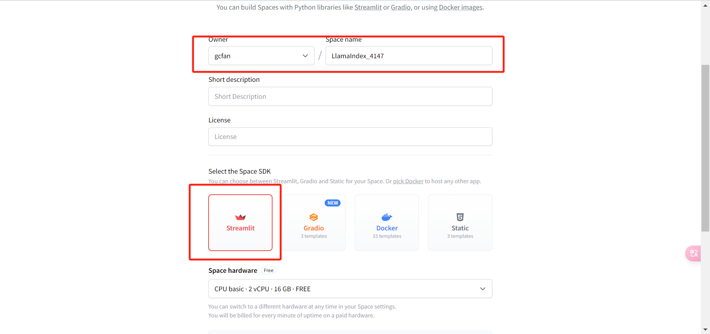

输入`Space Name`，选择`Streamlit`，创建Space

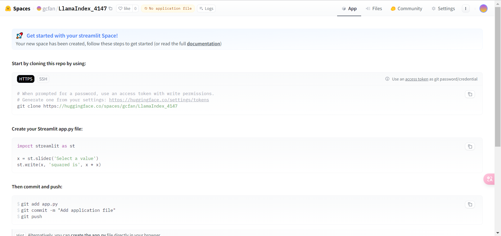

## 2.clone项目到本地

```bash
git clone https://huggingface.co/spaces/gcfan/LlamaIndex_4147
```

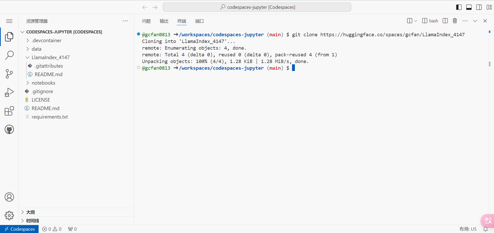

## 3.下载知识库

```bash
mkdir data
cd data
git clone https://github.com/gcfan0813/InternLM-Study.git
mv InternLM-Study/README.md ./ 
```

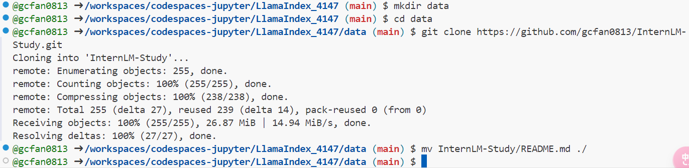

## 4.新建`app.py`并编辑代码

```bash
cd /workspaces/codespaces-jupyter/LlamaIndex_4147/
touch app.py
```

```python
import streamlit as st
from llama_index.core import VectorStoreIndex, SimpleDirectoryReader, Settings
from llama_index.embeddings.huggingface import HuggingFaceEmbedding
from llama_index.legacy.callbacks import CallbackManager
from llama_index.llms.openai_like import OpenAILike

# Create an instance of CallbackManager
callback_manager = CallbackManager()

api_base_url =  "https://internlm-chat.intern-ai.org.cn/puyu/api/v1/"
model = "internlm2.5-latest"
api_key = "xxxxxxxxxxxx"

# api_base_url =  "https://api.siliconflow.cn/v1"
# model = "internlm/internlm2_5-7b-chat"
# api_key = "请填写 API Key"

llm =OpenAILike(model=model, api_base=api_base_url, api_key=api_key, is_chat_model=True,callback_manager=callback_manager)


st.set_page_config(page_title="llama_index_demo", page_icon="🦜🔗")
st.title("llama_index_demo")

# 初始化模型
@st.cache_resource
def init_models():
    embed_model = HuggingFaceEmbedding(
        model_name="sentence-transformers/paraphrase-multilingual-MiniLM-L12-v2"
    )
    Settings.embed_model = embed_model

    #用初始化llm
    Settings.llm = llm

    documents = SimpleDirectoryReader("./data").load_data()
    index = VectorStoreIndex.from_documents(documents)
    query_engine = index.as_query_engine()

    return query_engine

# 检查是否需要初始化模型
if 'query_engine' not in st.session_state:
    st.session_state['query_engine'] = init_models()

def greet2(question):
    response = st.session_state['query_engine'].query(question)
    return response

      
# Store LLM generated responses
if "messages" not in st.session_state.keys():
    st.session_state.messages = [{"role": "assistant", "content": "你好，我是你的助手，有什么我可以帮助你的吗？"}]    

    # Display or clear chat messages
for message in st.session_state.messages:
    with st.chat_message(message["role"]):
        st.write(message["content"])

def clear_chat_history():
    st.session_state.messages = [{"role": "assistant", "content": "你好，我是你的助手，有什么我可以帮助你的吗？"}]

st.sidebar.button('Clear Chat History', on_click=clear_chat_history)

# Function for generating LLaMA2 response
def generate_llama_index_response(prompt_input):
    return greet2(prompt_input)

# User-provided prompt
if prompt := st.chat_input():
    st.session_state.messages.append({"role": "user", "content": prompt})
    with st.chat_message("user"):
        st.write(prompt)

# Gegenerate_llama_index_response last message is not from assistant
if st.session_state.messages[-1]["role"] != "assistant":
    with st.chat_message("assistant"):
        with st.spinner("Thinking..."):
            response = generate_llama_index_response(prompt)
            placeholder = st.empty()
            placeholder.markdown(response)
    message = {"role": "assistant", "content": response}
    st.session_state.messages.append(message)
```

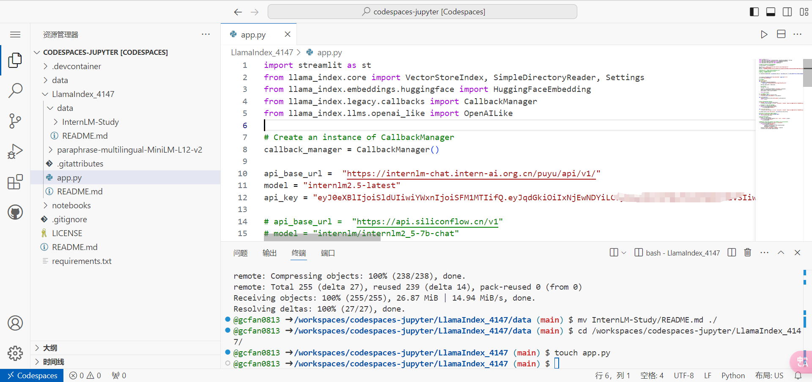

## 5.新建`requirements.txt`并编辑代码

```bash
touch requirements.txt
```

```tex
einops==0.7.0
protobuf==5.26.1
llama-index==0.11.20
llama-index-llms-replicate==0.3.0
llama-index-llms-openai-like==0.2.0
llama-index-embeddings-huggingface==0.3.1
llama-index-embeddings-instructor==0.2.1
torch==2.5.0
torchvision==0.20.0
torchaudio==2.5.0
```

## 6.编辑README.md，修改Streamlit版本

```markdown
---
title: LlamaIndex 4147
emoji: 🏃
colorFrom: purple
colorTo: green
sdk: streamlit
sdk_version: 1.40.0   ==>  1.39.0
app_file: app.py
pinned: false
---

Check out the configuration reference at https://huggingface.co/docs/hub/spaces-config-reference

```

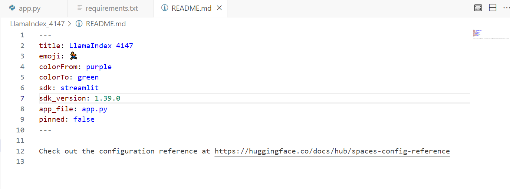

## 7.提交并推送

```bash
git add .
git commit -m "L1G4000 study"
git push
```

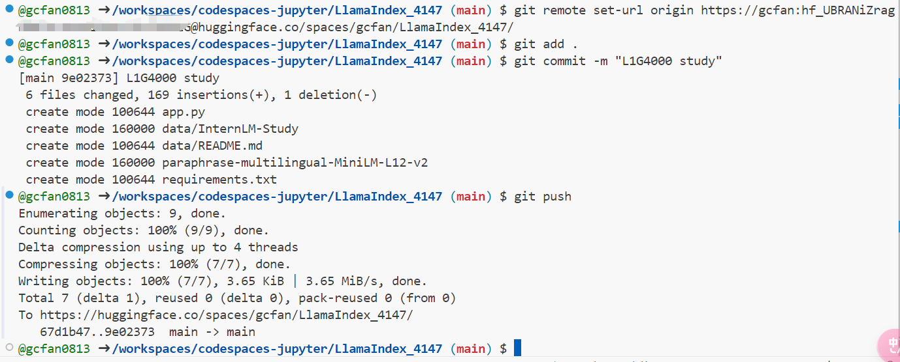

## 8.刷新Space页面

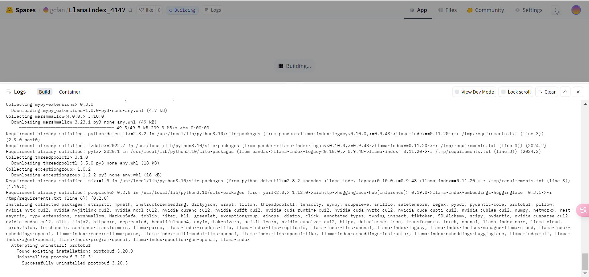

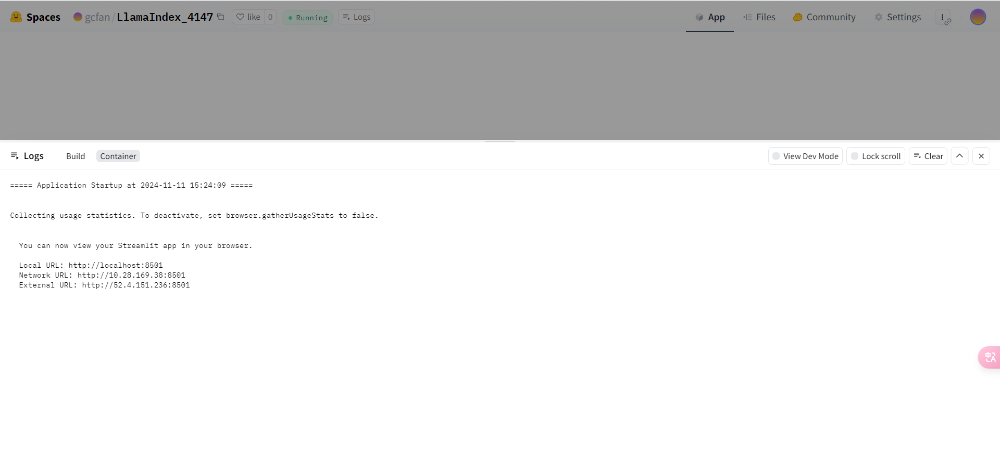

## 9.成功运行

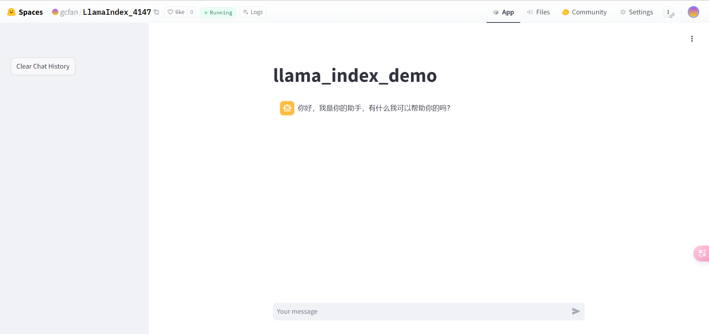

## 10.输入问题`Jim.Fan是谁？`

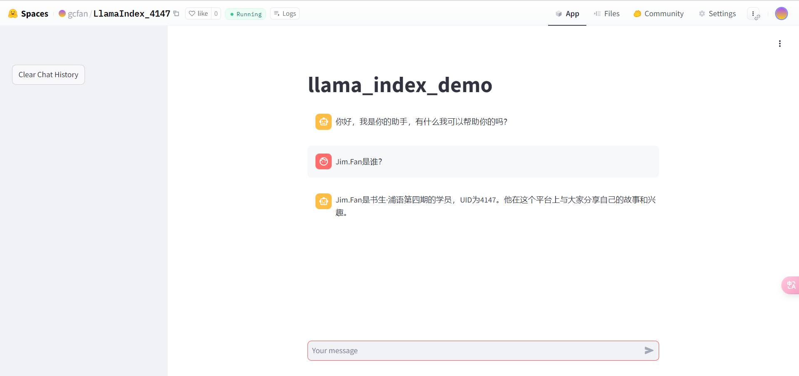

## 11.Hugging Face Space地址

[LlamaIndex_4147](https://huggingface.co/spaces/gcfan/LlamaIndex_4147)


**The End.**