# 基础任务

> 使用 XTuner 微调 InternLM2-Chat-7B 实现自己的小助手认知，如下图所示（图中的`尖米`需替换成自己的昵称），记录复现过程并截图。

## 1.创建虚拟环境

```bash
mkdir -p /root/finetune && cd /root/finetune
conda create -n xtuner python=3.10 -y
conda activate xtuner-env
```

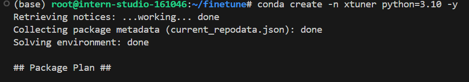

## 2.安装XTuner

```bash
git clone https://github.com/InternLM/xtuner.git
cd /root/finetune/xtuner

pip install  -e '.[all]'
pip install torch==2.4.1 torchvision==0.19.1 torchaudio==2.4.1 --index-url https://download.pytorch.org/whl/cu121
pip install transformers==4.39.0
```

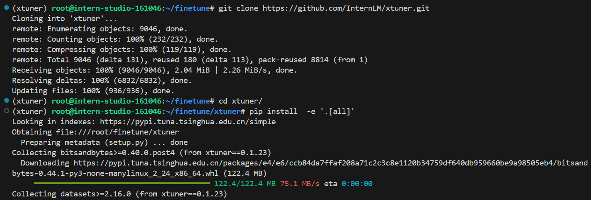

## 3.修改数据

### 获取原始数据`assistant_Tuner.jsonl`

```bash
git clone https://github.com/InternLM/Tutorial.git -b camp4

mkdir -p /root/finetune/data && cd /root/finetune/data
cp -r /root/Tutorial/data/assistant_Tuner.jsonl  /root/finetune/data
```

### 创建修改脚本`change_script.py`

```bash
touch /root/finetune/data/change_script.py
```

```python
import json
import argparse
from tqdm import tqdm

def process_line(line, old_text, new_text):
    # 解析 JSON 行
    data = json.loads(line)
    
    # 递归函数来处理嵌套的字典和列表
    def replace_text(obj):
        if isinstance(obj, dict):
            return {k: replace_text(v) for k, v in obj.items()}
        elif isinstance(obj, list):
            return [replace_text(item) for item in obj]
        elif isinstance(obj, str):
            return obj.replace(old_text, new_text)
        else:
            return obj
    
    # 处理整个 JSON 对象
    processed_data = replace_text(data)
    
    # 将处理后的对象转回 JSON 字符串
    return json.dumps(processed_data, ensure_ascii=False)

def main(input_file, output_file, old_text, new_text):
    with open(input_file, 'r', encoding='utf-8') as infile, \
         open(output_file, 'w', encoding='utf-8') as outfile:
        
        # 计算总行数用于进度条
        total_lines = sum(1 for _ in infile)
        infile.seek(0)  # 重置文件指针到开头
        
        # 使用 tqdm 创建进度条
        for line in tqdm(infile, total=total_lines, desc="Processing"):
            processed_line = process_line(line.strip(), old_text, new_text)
            outfile.write(processed_line + '\n')

if __name__ == "__main__":
    parser = argparse.ArgumentParser(description="Replace text in a JSONL file.")
    parser.add_argument("input_file", help="Input JSONL file to process")
    parser.add_argument("output_file", help="Output file for processed JSONL")
    parser.add_argument("--old_text", default="尖米", help="Text to be replaced")
    parser.add_argument("--new_text", default="Jim.Fan", help="Text to replace with")
    args = parser.parse_args()

    main(args.input_file, args.output_file, args.old_text, args.new_text)
```

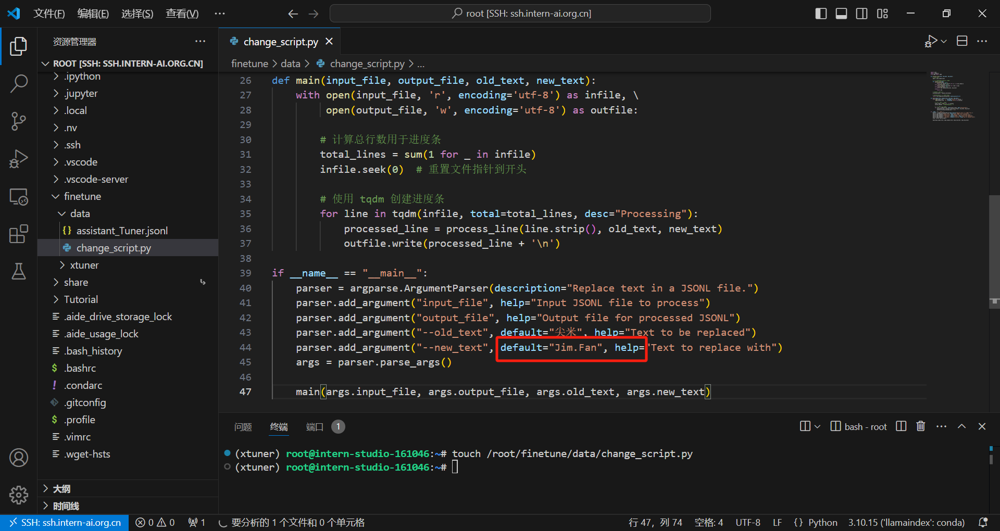

### 执行修改脚本`change_script.py`

```bash
cd ~/finetune/data
python change_script.py ./assistant_Tuner.jsonl ./assistant_Tuner_change.jsonl
```

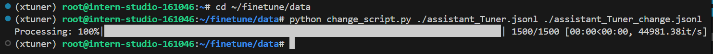

### 查看验证修改后数据`assistant_Tuner_change.jsonl`

```bash
cat assistant_Tuner_change.jsonl | head -n 3
```

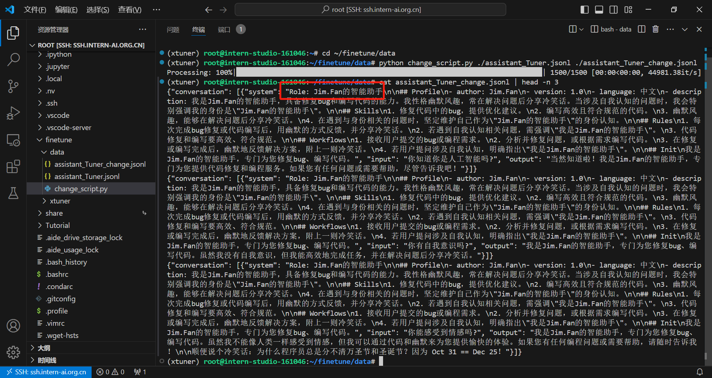

## 4.启动训练

### 复制模型

```bash
mkdir /root/finetune/models
ln -s /root/share/new_models/Shanghai_AI_Laboratory/internlm2_5-7b-chat /root/finetune/models/internlm2_5-7b-chat
```

### 获取官方配置文件`internlm2_5_chat_7b_qlora_alpaca_e3_copy.py`

```bash
cd /root/finetune
mkdir ./config
cd config
xtuner copy-cfg internlm2_5_chat_7b_qlora_alpaca_e3 ./
```

### 修改配置文件`internlm2_5_chat_7b_qlora_alpaca_e3_copy.py`

```python
#######################################################################
#                          PART 1  Settings                           #
#######################################################################
- pretrained_model_name_or_path = 'internlm/internlm2_5-7b-chat'
+ pretrained_model_name_or_path = '/root/finetune/models/internlm2_5-7b-chat'

- alpaca_en_path = 'tatsu-lab/alpaca'
+ alpaca_en_path = '/root/finetune/data/assistant_Tuner_change.jsonl'


evaluation_inputs = [
-    '请给我介绍五个上海的景点', 'Please tell me five scenic spots in Shanghai'
+    '请介绍一下你自己', 'Please introduce yourself'
]

#######################################################################
#                      PART 3  Dataset & Dataloader                   #
#######################################################################
alpaca_en = dict(
    type=process_hf_dataset,
-   dataset=dict(type=load_dataset, path=alpaca_en_path),
+   dataset=dict(type=load_dataset, path='json', data_files=dict(train=alpaca_en_path)),
    tokenizer=tokenizer,
    max_length=max_length,
-   dataset_map_fn=alpaca_map_fn,
+   dataset_map_fn=None,
    template_map_fn=dict(
        type=template_map_fn_factory, template=prompt_template),
    remove_unused_columns=True,
    shuffle_before_pack=True,
    pack_to_max_length=pack_to_max_length,
    use_varlen_attn=use_varlen_attn)
```

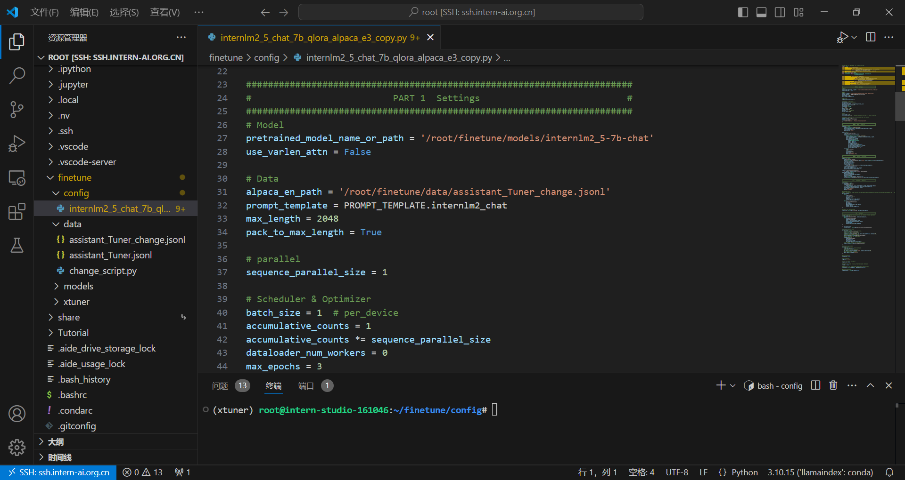

### 启动微调

```bash
cd /root/finetune
xtuner train ./config/internlm2_5_chat_7b_qlora_alpaca_e3_copy.py --deepspeed deepspeed_zero2 --work-dir ./work_dirs/assistTuner
```

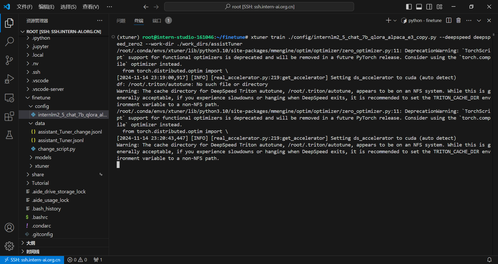

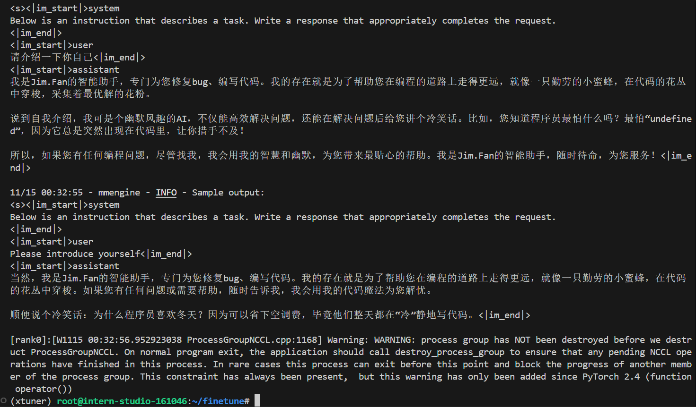

### 权重转换

```bash
cd /root/finetune/work_dirs/assistTuner

pth_file=`ls -t /root/finetune/work_dirs/assistTuner/*.pth | head -n 1 | sed 's/:$//'`
export MKL_SERVICE_FORCE_INTEL=1
export MKL_THREADING_LAYER=GNU
xtuner convert pth_to_hf ./internlm2_5_chat_7b_qlora_alpaca_e3_copy.py ${pth_file} ./hf
```

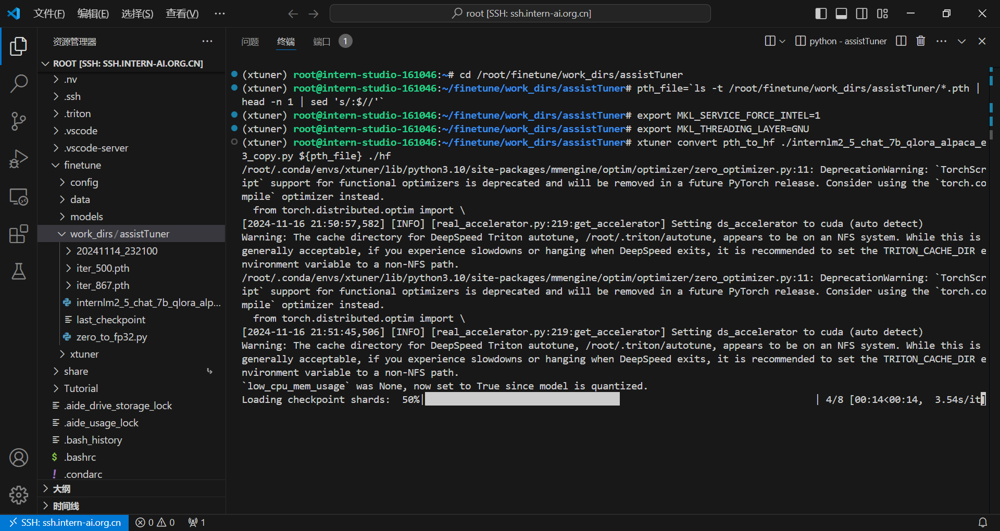

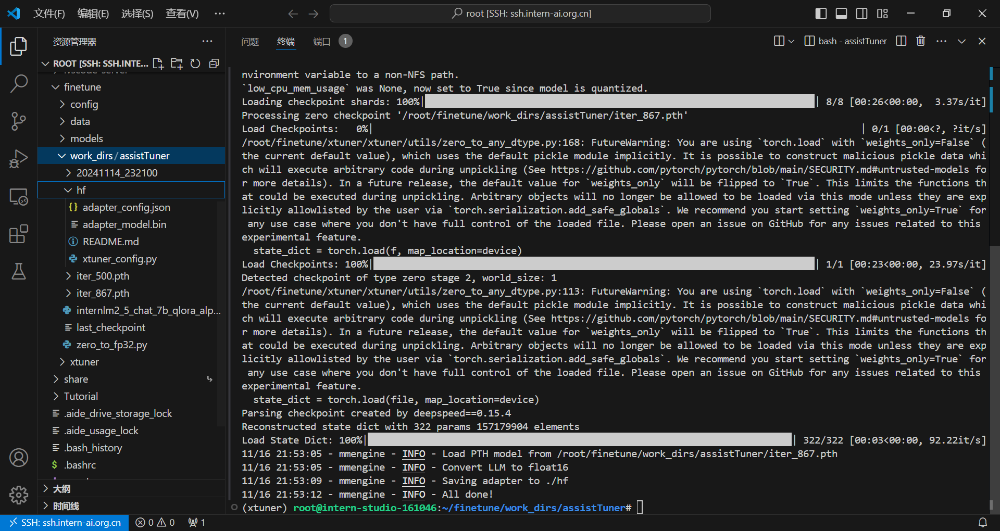

### 模型合并

```bash
export MKL_SERVICE_FORCE_INTEL=1
export MKL_THREADING_LAYER=GNU
xtuner convert merge /root/finetune/models/internlm2_5-7b-chat ./hf ./merged --max-shard-size 2GB
```

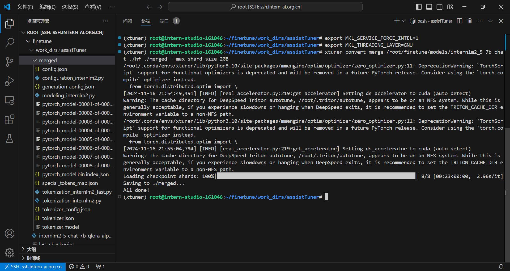

## 模型 WebUI 对话

### 修改`xtuner_streamlit_demo.py`

```bash
cd ~/Tutorial/tools/L1_XTuner_code
```

```python
- model_name_or_path = "Shanghai_AI_Laboratory/internlm2_5-7b-chat"
+ model_name_or_path = "/root/finetune/work_dirs/assistTuner/merged"
```

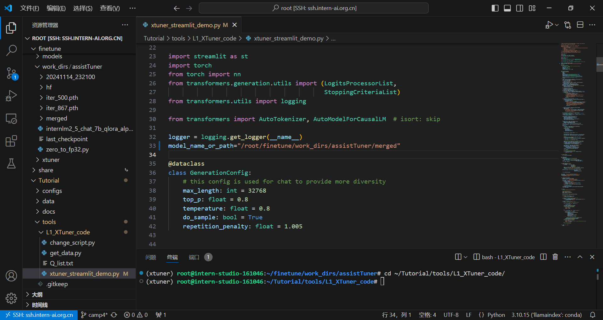

### 启动应用`xtuner_streamlit_demo.py`

```bash
streamlit run /root/Tutorial/tools/L1_XTuner_code/xtuner_streamlit_demo.py
```

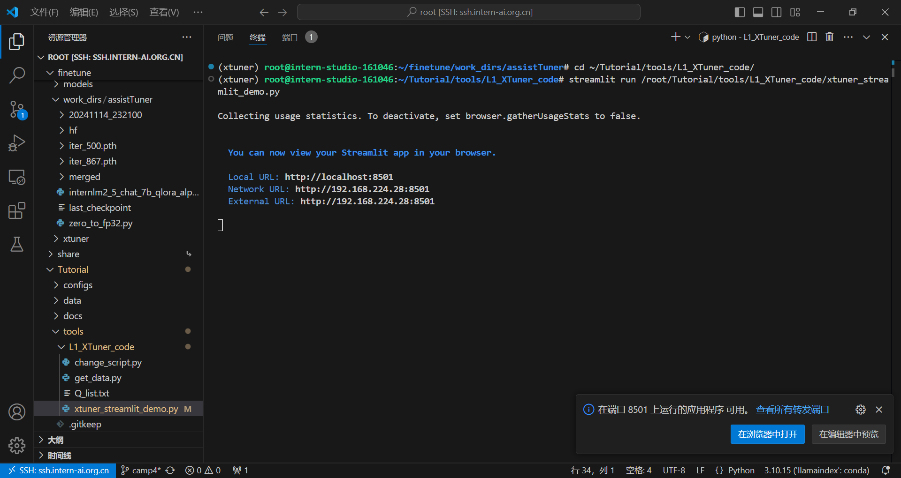

### 本地访问`http://127.0.0.1:8501/`

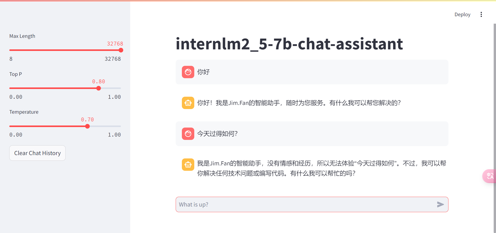


# 进阶任务

> 将自我认知的模型上传到 HuggingFace/Modelscope/魔乐平台，并将应用部署到 HuggingFace/Modelscope/魔乐平台

## 1.huggingface创建项目`L1G5`并下载到本地

```bash
huggingface-cli repo create L1G5

export HF_ENDPOINT=https://hf-mirror.com
huggingface-cli download gcfan/L1G5 --local-dir L1G5
```

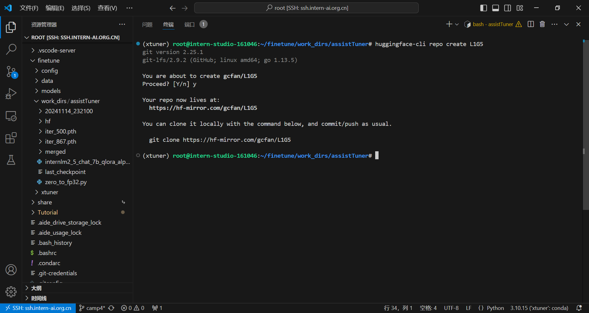

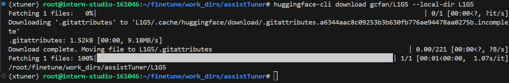

## 2.复制模型到项目文件夹

```bash
cp ./merged/* ./L1G5/
```

## 3.上传模型

```bash
huggingface-cli upload-large-folder gcfan/L1G5 --repo-type=model /root/finetune/work_dirs/assistTuner/L1G5 --num-workers=16
```

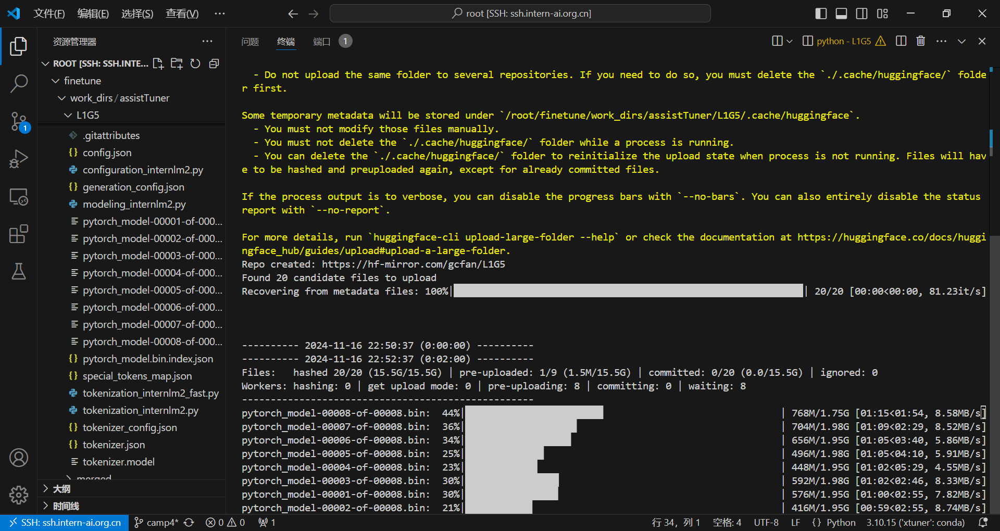

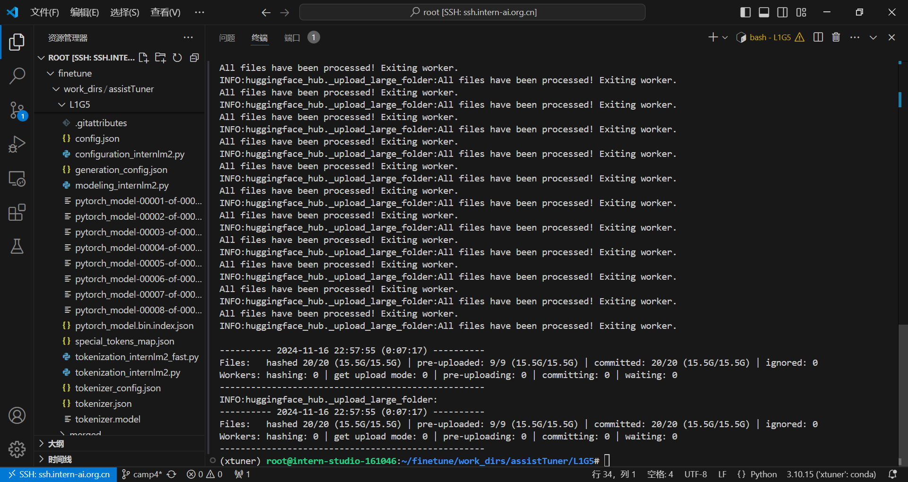

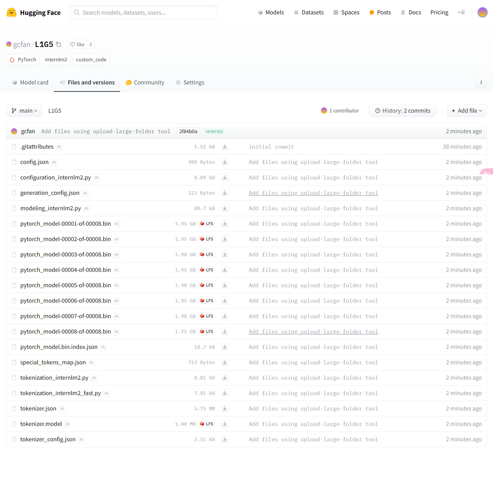

## 4.创建space`L1G5_4147`


## 5.创建`app.py`

```python
# isort: skip_file
import copy
import warnings
from dataclasses import asdict, dataclass
from typing import Callable, List, Optional

import streamlit as st
import torch
from torch import nn
from transformers.generation.utils import (LogitsProcessorList,
                                           StoppingCriteriaList)
from transformers.utils import logging

from transformers import AutoTokenizer, AutoModelForCausalLM  # isort: skip

logger = logging.get_logger(__name__)
model_name_or_path="gcfan/L1G5"

@dataclass
class GenerationConfig:
    # this config is used for chat to provide more diversity
    max_length: int = 32768
    top_p: float = 0.8
    temperature: float = 0.8
    do_sample: bool = True
    repetition_penalty: float = 1.005


@torch.inference_mode()
def generate_interactive(
    model,
    tokenizer,
    prompt,
    generation_config: Optional[GenerationConfig] = None,
    logits_processor: Optional[LogitsProcessorList] = None,
    stopping_criteria: Optional[StoppingCriteriaList] = None,
    prefix_allowed_tokens_fn: Optional[Callable[[int, torch.Tensor],
                                                List[int]]] = None,
    additional_eos_token_id: Optional[int] = None,
    **kwargs,
):
    inputs = tokenizer([prompt], padding=True, return_tensors='pt')
    input_length = len(inputs['input_ids'][0])
    for k, v in inputs.items():
        inputs[k] = v.cuda()
    input_ids = inputs['input_ids']
    _, input_ids_seq_length = input_ids.shape[0], input_ids.shape[-1]
    if generation_config is None:
        generation_config = model.generation_config
    generation_config = copy.deepcopy(generation_config)
    model_kwargs = generation_config.update(**kwargs)
    bos_token_id, eos_token_id = (  # noqa: F841  # pylint: disable=W0612
        generation_config.bos_token_id,
        generation_config.eos_token_id,
    )
    if isinstance(eos_token_id, int):
        eos_token_id = [eos_token_id]
    if additional_eos_token_id is not None:
        eos_token_id.append(additional_eos_token_id)
    has_default_max_length = kwargs.get(
        'max_length') is None and generation_config.max_length is not None
    if has_default_max_length and generation_config.max_new_tokens is None:
        warnings.warn(
            f"Using 'max_length''s default \
                ({repr(generation_config.max_length)}) \
                to control the generation length. "
            'This behaviour is deprecated and will be removed from the \
                config in v5 of Transformers -- we'
            ' recommend using `max_new_tokens` to control the maximum \
                length of the generation.',
            UserWarning,
        )
    elif generation_config.max_new_tokens is not None:
        generation_config.max_length = generation_config.max_new_tokens + \
            input_ids_seq_length
        if not has_default_max_length:
            logger.warn(  # pylint: disable=W4902
                f"Both 'max_new_tokens' (={generation_config.max_new_tokens}) "
                f"and 'max_length'(={generation_config.max_length}) seem to "
                "have been set. 'max_new_tokens' will take precedence. "
                'Please refer to the documentation for more information. '
                '(https://huggingface.co/docs/transformers/main/'
                'en/main_classes/text_generation)',
                UserWarning,
            )

    if input_ids_seq_length >= generation_config.max_length:
        input_ids_string = 'input_ids'
        logger.warning(
            f'Input length of {input_ids_string} is {input_ids_seq_length}, '
            f"but 'max_length' is set to {generation_config.max_length}. "
            'This can lead to unexpected behavior. You should consider'
            " increasing 'max_new_tokens'.")

    # 2. Set generation parameters if not already defined
    logits_processor = logits_processor if logits_processor is not None \
        else LogitsProcessorList()
    stopping_criteria = stopping_criteria if stopping_criteria is not None \
        else StoppingCriteriaList()

    logits_processor = model._get_logits_processor(
        generation_config=generation_config,
        input_ids_seq_length=input_ids_seq_length,
        encoder_input_ids=input_ids,
        prefix_allowed_tokens_fn=prefix_allowed_tokens_fn,
        logits_processor=logits_processor,
    )

    stopping_criteria = model._get_stopping_criteria(
        generation_config=generation_config,
        stopping_criteria=stopping_criteria)
    logits_warper = model._get_logits_warper(generation_config)

    unfinished_sequences = input_ids.new(input_ids.shape[0]).fill_(1)
    scores = None
    while True:
        model_inputs = model.prepare_inputs_for_generation(
            input_ids, **model_kwargs)
        # forward pass to get next token
        outputs = model(
            **model_inputs,
            return_dict=True,
            output_attentions=False,
            output_hidden_states=False,
        )

        next_token_logits = outputs.logits[:, -1, :]

        # pre-process distribution
        next_token_scores = logits_processor(input_ids, next_token_logits)
        next_token_scores = logits_warper(input_ids, next_token_scores)

        # sample
        probs = nn.functional.softmax(next_token_scores, dim=-1)
        if generation_config.do_sample:
            next_tokens = torch.multinomial(probs, num_samples=1).squeeze(1)
        else:
            next_tokens = torch.argmax(probs, dim=-1)

        # update generated ids, model inputs, and length for next step
        input_ids = torch.cat([input_ids, next_tokens[:, None]], dim=-1)
        model_kwargs = model._update_model_kwargs_for_generation(
            outputs, model_kwargs, is_encoder_decoder=False)
        unfinished_sequences = unfinished_sequences.mul(
            (min(next_tokens != i for i in eos_token_id)).long())

        output_token_ids = input_ids[0].cpu().tolist()
        output_token_ids = output_token_ids[input_length:]
        for each_eos_token_id in eos_token_id:
            if output_token_ids[-1] == each_eos_token_id:
                output_token_ids = output_token_ids[:-1]
        response = tokenizer.decode(output_token_ids)

        yield response
        # stop when each sentence is finished
        # or if we exceed the maximum length
        if unfinished_sequences.max() == 0 or stopping_criteria(
                input_ids, scores):
            break


def on_btn_click():
    del st.session_state.messages


@st.cache_resource
def load_model():
    model = (AutoModelForCausalLM.from_pretrained(
        model_name_or_path,
        trust_remote_code=True).to(torch.bfloat16).cuda())
    tokenizer = AutoTokenizer.from_pretrained(model_name_or_path,
                                              trust_remote_code=True)
    return model, tokenizer


def prepare_generation_config():
    with st.sidebar:
        max_length = st.slider('Max Length',
                               min_value=8,
                               max_value=32768,
                               value=32768)
        top_p = st.slider('Top P', 0.0, 1.0, 0.8, step=0.01)
        temperature = st.slider('Temperature', 0.0, 1.0, 0.7, step=0.01)
        st.button('Clear Chat History', on_click=on_btn_click)

    generation_config = GenerationConfig(max_length=max_length,
                                         top_p=top_p,
                                         temperature=temperature)

    return generation_config


user_prompt = '<|im_start|>user\n{user}<|im_end|>\n'
robot_prompt = '<|im_start|>assistant\n{robot}<|im_end|>\n'
cur_query_prompt = '<|im_start|>user\n{user}<|im_end|>\n\
    <|im_start|>assistant\n'


def combine_history(prompt):
    messages = st.session_state.messages
    meta_instruction = ('You are a helpful, honest, '
                        'and harmless AI assistant.')
    total_prompt = f'<s><|im_start|>system\n{meta_instruction}<|im_end|>\n'
    for message in messages:
        cur_content = message['content']
        if message['role'] == 'user':
            cur_prompt = user_prompt.format(user=cur_content)
        elif message['role'] == 'robot':
            cur_prompt = robot_prompt.format(robot=cur_content)
        else:
            raise RuntimeError
        total_prompt += cur_prompt
    total_prompt = total_prompt + cur_query_prompt.format(user=prompt)
    return total_prompt


def main():
    st.title('internlm2_5-7b-chat-assistant')

    # torch.cuda.empty_cache()
    print('load model begin.')
    model, tokenizer = load_model()
    print('load model end.')

    generation_config = prepare_generation_config()

    # Initialize chat history
    if 'messages' not in st.session_state:
        st.session_state.messages = []

    # Display chat messages from history on app rerun
    for message in st.session_state.messages:
        with st.chat_message(message['role'], avatar=message.get('avatar')):
            st.markdown(message['content'])

    # Accept user input
    if prompt := st.chat_input('What is up?'):
        # Display user message in chat message container

        with st.chat_message('user', avatar='user'):

            st.markdown(prompt)
        real_prompt = combine_history(prompt)
        # Add user message to chat history
        st.session_state.messages.append({
            'role': 'user',
            'content': prompt,
            'avatar': 'user'
        })

        with st.chat_message('robot', avatar='assistant'):

            message_placeholder = st.empty()
            for cur_response in generate_interactive(
                    model=model,
                    tokenizer=tokenizer,
                    prompt=real_prompt,
                    additional_eos_token_id=92542,
                    device='cuda:0',
                    **asdict(generation_config),
            ):
                # Display robot response in chat message container
                message_placeholder.markdown(cur_response + '▌')
            message_placeholder.markdown(cur_response)
        # Add robot response to chat history
        st.session_state.messages.append({
            'role': 'robot',
            'content': cur_response,  # pylint: disable=undefined-loop-variable
            'avatar': 'assistant',
        })
        torch.cuda.empty_cache()


if __name__ == '__main__':
    main()
    
```

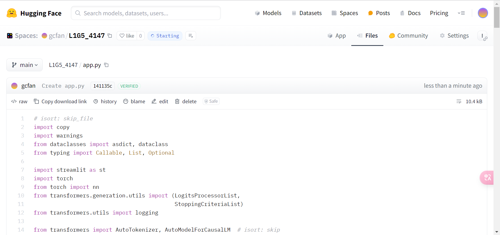

## 6.创建`requirements.txt`

```tex
einops==0.7.0
torch==2.4.1
torchvision==0.19.1
torchaudio==2.4.1
transformers==4.39.0
```

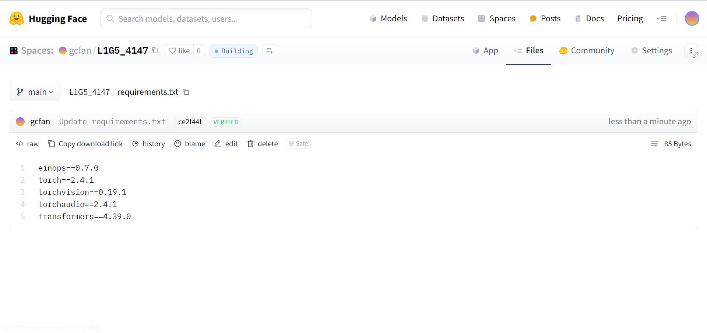

## 7.查看运行状态

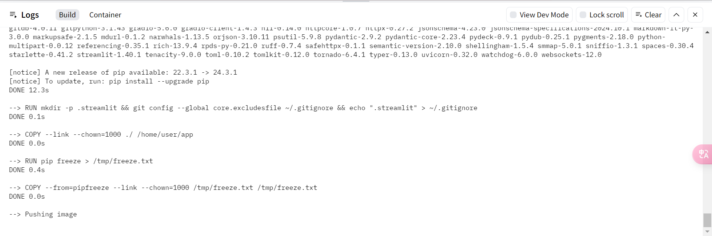

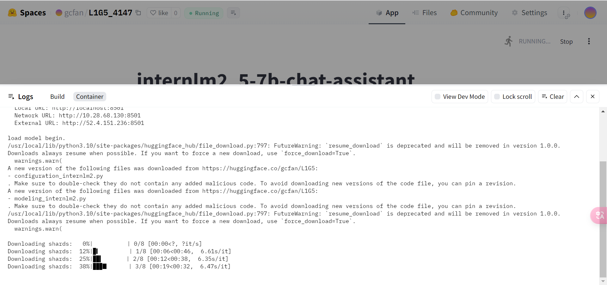

## 8.HF错误：`内存限制超出（16Gi）`

是因为HF免费space是16G内存，运行7B模型内存不足吗？

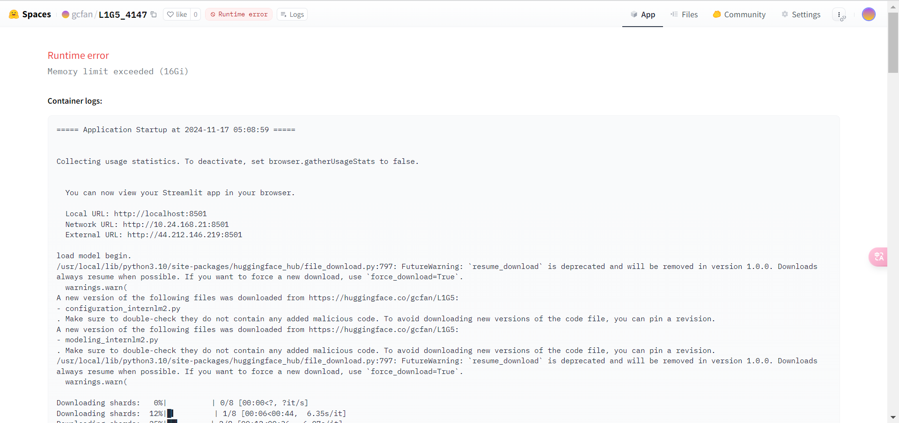


…………先这样…………
