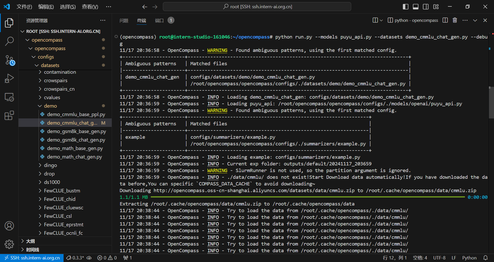
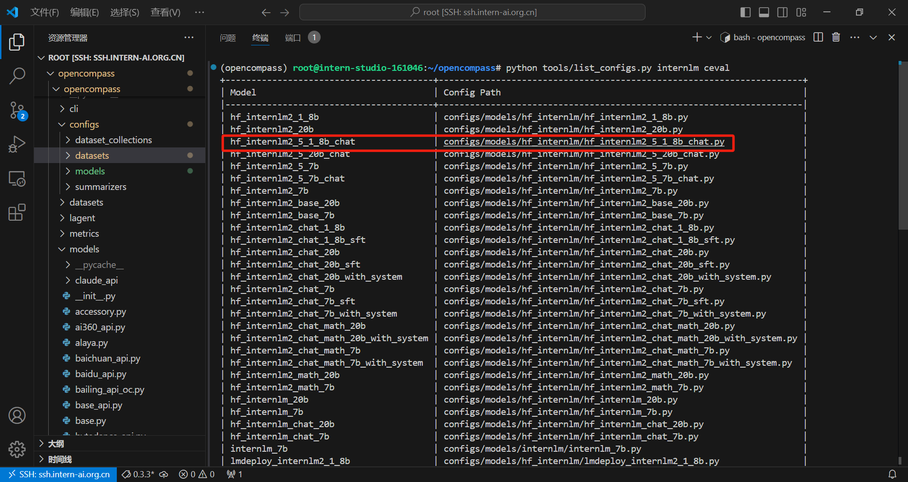
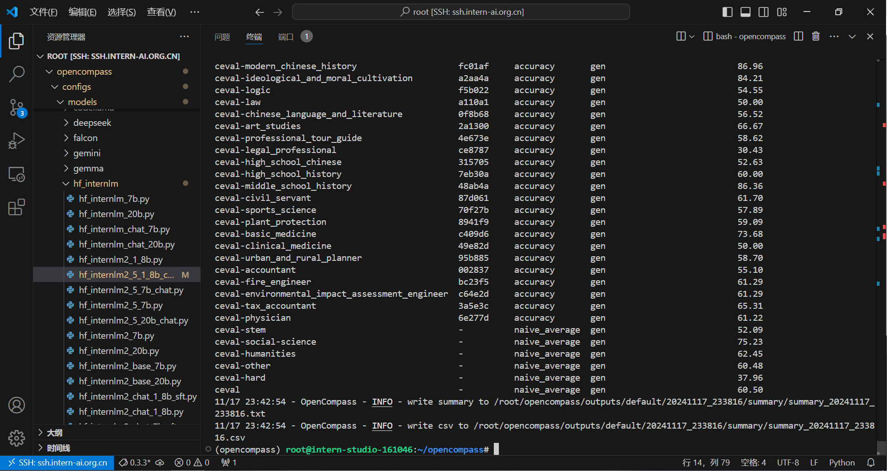

# 创建开发环境`opencompass`

```bash
conda create -n opencompass python=3.10
conda activate opencompass

cd /root
git clone -b 0.3.3 https://github.com/open-compass/opencompass
cd opencompass
pip install -e .
pip install -r requirements.txt
pip install huggingface_hub==0.25.2
```


# OpenCompass 评测浦语 API

> 使用 OpenCompass 评测浦语 API 记录复现过程并截图。

## 1.获取internlm api key并设置环境变量

```bash
export INTERNLM_API_KEY=xxxxxxxxxxxxxxxxxxxxxxx
```

## 2.配置模型`puyu_api.py`

```bash
cd /root/opencompass/ 
touch opencompass/configs/models/openai/puyu_api.py
```

```python
import os
from opencompass.models import OpenAISDK

internlm_url = 'https://internlm-chat.intern-ai.org.cn/puyu/api/v1/'
internlm_api_key = os.getenv('INTERNLM_API_KEY')

models = [
    dict(
        # abbr='internlm2.5-latest',
        type=OpenAISDK,
        # 请求服务时的 model name
        path='internlm2.5-latest', 
        # 换成自己申请的APIkey
        key=internlm_api_key, # API key
        openai_api_base=internlm_url, # 服务地址
        rpm_verbose=True, # 是否打印请求速率
        query_per_second=0.16, # 服务请求速率
        max_out_len=1024, # 最大输出长度
        max_seq_len=4096, # 最大输入长度
        temperature=0.01, # 生成温度
        batch_size=1, # 批处理大小
        retry=3, # 重试次数
    )
]
```


## 3.配置评测数据集`demo_cmmlu_chat_gen.py`

```bash
cd /root/opencompass/ 
touch opencompass/configs/datasets/demo/demo_cmmlu_chat_gen.py
```

```python
from mmengine import read_base

with read_base():
    from ..cmmlu.cmmlu_gen_c13365 import cmmlu_datasets

# 每个数据集只取前1个样本进行评测
for d in cmmlu_datasets:
    d['abbr'] = 'demo_' + d['abbr']
    d['reader_cfg']['test_range'] = '[0:1]' 

```


## 4.启动评测

```bash
python run.py --models puyu_api.py --datasets demo_cmmlu_chat_gen.py --debug
```

> 报错`ModuleNotFoundError: No module named 'rouge'`
>
> 
>
> 解决方法：
>
> ```bash
> conda install -c conda-forge rouge
> ```
>
> 



## 5.查看结果


# OpenCompass 评测 internlm2.5-chat-1.8b 模型在 ceval 数据集上的性能

> 使用 OpenCompass 评测 internlm2.5-chat-1.8b 模型在 ceval 数据集上的性能，记录复现过程并截图。

## 1.初始化环境

```bash
cd /root/opencompass
conda activate opencompass
conda install pytorch==2.1.2 torchvision==0.16.2 torchaudio==2.1.2 pytorch-cuda=12.1 -c pytorch -c nvidia -y
apt-get update
apt-get install cmake
pip install protobuf==4.25.3
pip install huggingface-hub==0.23.2
```

## 2.下载数据集

```bash
cp /share/temp/datasets/OpenCompassData-core-20231110.zip /root/opencompass/
unzip OpenCompassData-core-20231110.zip
```

## 3.查看配置文件列表

```bash
python tools/list_configs.py internlm ceval
```



## 4.编辑`hf_internlm2_5_1_8b_chat.py`

```python
from opencompass.models import HuggingFacewithChatTemplate

models = [
    dict(
        type=HuggingFacewithChatTemplate,
        abbr='internlm2_5-1_8b-chat-hf',
        path='/share/new_models/Shanghai_AI_Laboratory/internlm2_5-1_8b-chat/',
        max_out_len=2048,
        batch_size=8,
        run_cfg=dict(num_gpus=1),
    )
]

# python run.py --datasets ceval_gen --models hf_internlm2_5_1_8b_chat --debug
```


## 5.启动评测

```bash
python run.py --datasets ceval_gen --models hf_internlm2_5_1_8b_chat --debug
```


## 6.查看结果





# OpenCompass 评测 InternLM2-Chat-1.8B 模型使用 LMDeploy部署后在 ceval 数据集上的性能

## 1.安装部署`LMDeploy`

```bash
pip install lmdeploy==0.6.1 openai==1.52.0

lmdeploy serve api_server /share/new_models/Shanghai_AI_Laboratory/internlm2-chat-1_8b/ --server-port 23333
```


## 2.获取`model_name`

```bash
touch ./lmdeploy_model_name.py
```

```python
from openai import OpenAI
client = OpenAI(
    api_key='sk-123456', # 可以设置成随意的字符串
    base_url="http://0.0.0.0:23333/v1"
)
model_name = client.models.list().data[0].id
print(model_name)    # 注册的模型名称需要被用于后续配置.
```


```bash
python ./lmdeploy_model_name.py
```


## 3.创建评测配置脚本`hf_internlm2_chat_1_8b_api.py`

```bash
touch opencompass/configs/models/hf_internlm/hf_internlm2_chat_1_8b_api.py
```

```python
from opencompass.models import OpenAI

api_meta_template = dict(round=[
    dict(role='HUMAN', api_role='HUMAN'),
    dict(role='BOT', api_role='BOT', generate=True),
])

models = [
    dict(
        abbr='internlm2-chat-1.8b',
        type=OpenAI,
        path='/share/new_models/Shanghai_AI_Laboratory/internlm2-chat-1_8b/', # 注册的模型名称
        key='sk-123456',
        openai_api_base='http://0.0.0.0:23333/v1/chat/completions', 
        meta_template=api_meta_template,
        query_per_second=1,
        max_out_len=2048,
        max_seq_len=4096,
        batch_size=8),
]
```


## 4.启动评测

```bash
opencompass --models hf_internlm2_chat_1_8b_api --datasets ceval_gen --debug
```


## 5.查看结果


**The End.**