# 任务一：使用 Lagent 复现文档中 “制作一个属于自己的Agent”

## 1.创建虚拟环境及安装依赖

```bash
# 创建环境
conda create -n lagent python=3.10 -y
# 激活环境
conda activate lagent
# 安装 torch
conda install pytorch==2.1.2 torchvision==0.16.2 torchaudio==2.1.2 pytorch-cuda=12.1 -c pytorch -c nvidia -y
# 安装其他依赖包
pip install termcolor==2.4.0
pip install streamlit==1.39.0
pip install class_registry==2.1.2
pip install datasets==3.1.0
```

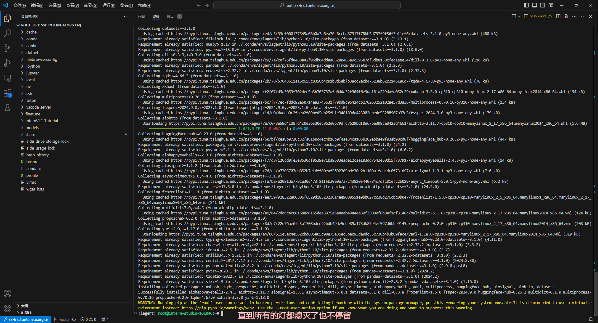

## 2.安装lagent

```bash
git clone https://github.com/InternLM/lagent.git
cd lagent && git checkout e304e5d && pip install -e . && cd ..
pip install griffe==0.48.0
```

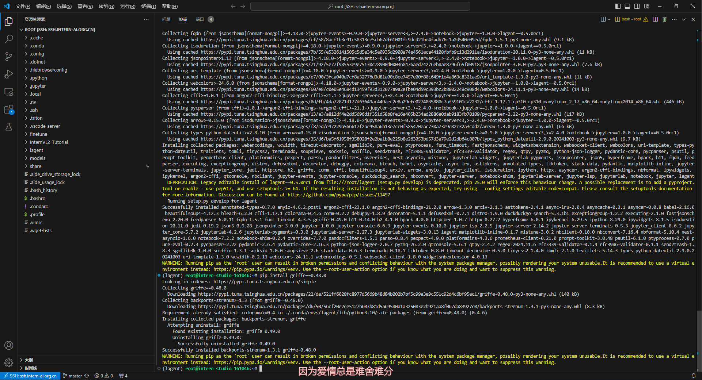

## 3.创建一个天气查询的工具程序`weather_query.py`

```bash
cd /root/lagent/lagent/actions
touch weather_query.py
```

```python
import os
import requests
from lagent.actions.base_action import BaseAction, tool_api
from lagent.schema import ActionReturn, ActionStatusCode

class WeatherQuery(BaseAction):
    def __init__(self):
        super().__init__()
        self.api_key = os.getenv("weather_token")
        print(self.api_key)
        if not self.api_key:
            raise EnvironmentError("未找到环境变量 'token'。请设置你的和风天气 API Key 到 'weather_token' 环境变量中，比如export weather_token='xxx' ")

    @tool_api
    def run(self, location: str) -> dict:
        """
        查询实时天气信息。

        Args:
            location (str): 要查询的地点名称、LocationID 或经纬度坐标（如 "101010100" 或 "116.41,39.92"）。

        Returns:
            dict: 包含天气信息的字典
                * location: 地点名称
                * weather: 天气状况
                * temperature: 当前温度
                * wind_direction: 风向
                * wind_speed: 风速（公里/小时）
                * humidity: 相对湿度（%）
                * report_time: 数据报告时间
        """
        try:
            # 如果 location 不是坐标格式（例如 "116.41,39.92"），则调用 GeoAPI 获取 LocationID
            if not ("," in location and location.replace(",", "").replace(".", "").isdigit()):
                # 使用 GeoAPI 获取 LocationID
                geo_url = f"https://geoapi.qweather.com/v2/city/lookup?location={location}&key={self.api_key}"
                geo_response = requests.get(geo_url)
                geo_data = geo_response.json()

                if geo_data.get("code") != "200" or not geo_data.get("location"):
                    raise Exception(f"GeoAPI 返回错误码：{geo_data.get('code')} 或未找到位置")

                location = geo_data["location"][0]["id"]

            # 构建天气查询的 API 请求 URL
            weather_url = f"https://devapi.qweather.com/v7/weather/now?location={location}&key={self.api_key}"
            response = requests.get(weather_url)
            data = response.json()

            # 检查 API 响应码
            if data.get("code") != "200":
                raise Exception(f"Weather API 返回错误码：{data.get('code')}")

            # 解析和组织天气信息
            weather_info = {
                "location": location,
                "weather": data["now"]["text"],
                "temperature": data["now"]["temp"] + "°C", 
                "wind_direction": data["now"]["windDir"],
                "wind_speed": data["now"]["windSpeed"] + " km/h",  
                "humidity": data["now"]["humidity"] + "%",
                "report_time": data["updateTime"]
            }

            return {"result": weather_info}

        except Exception as exc:
            return ActionReturn(
                errmsg=f"WeatherQuery 异常：{exc}",
                state=ActionStatusCode.HTTP_ERROR
            )
```

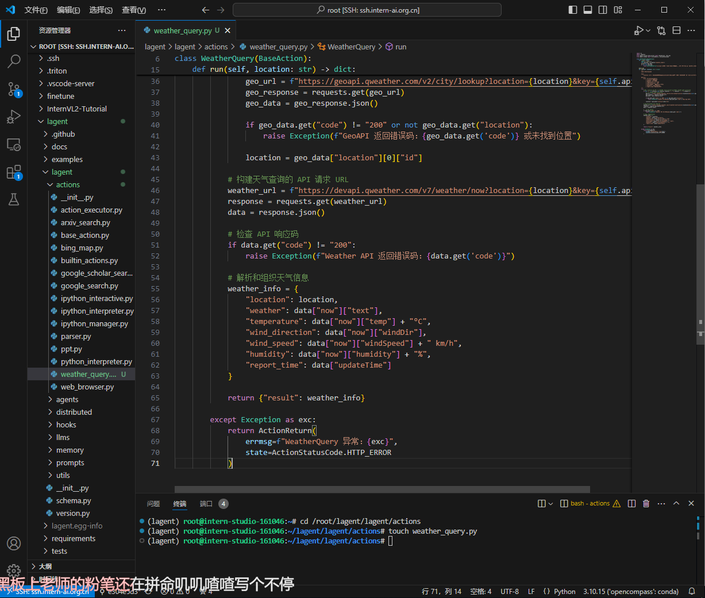

## 4.修改`/root/lagent/lagent/actions/__init__.py`

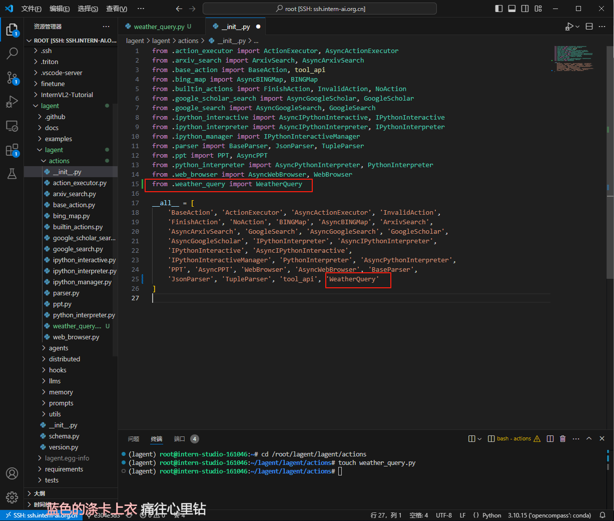

## 5.创建`agent_api_web_demo.py`

```bash
cd /root/lagent/examples
touch agent_api_web_demo.py
```

```python
import copy
import os
from typing import List
import streamlit as st
from lagent.actions import ArxivSearch, WeatherQuery
from lagent.prompts.parsers import PluginParser
from lagent.agents.stream import INTERPRETER_CN, META_CN, PLUGIN_CN, AgentForInternLM, get_plugin_prompt
from lagent.llms import GPTAPI

class SessionState:
    """管理会话状态的类。"""

    def init_state(self):
        """初始化会话状态变量。"""
        st.session_state['assistant'] = []  # 助手消息历史
        st.session_state['user'] = []  # 用户消息历史
        # 初始化插件列表
        action_list = [
            ArxivSearch(),
            WeatherQuery(),
        ]
        st.session_state['plugin_map'] = {action.name: action for action in action_list}
        st.session_state['model_map'] = {}  # 存储模型实例
        st.session_state['model_selected'] = None  # 当前选定模型
        st.session_state['plugin_actions'] = set()  # 当前激活插件
        st.session_state['history'] = []  # 聊天历史
        st.session_state['api_base'] = None  # 初始化API base地址

    def clear_state(self):
        """清除当前会话状态。"""
        st.session_state['assistant'] = []
        st.session_state['user'] = []
        st.session_state['model_selected'] = None


class StreamlitUI:
    """管理 Streamlit 界面的类。"""

    def __init__(self, session_state: SessionState):
        self.session_state = session_state
        self.plugin_action = []  # 当前选定的插件
        # 初始化提示词
        self.meta_prompt = META_CN
        self.plugin_prompt = PLUGIN_CN
        self.init_streamlit()

    def init_streamlit(self):
        """初始化 Streamlit 的 UI 设置。"""
        st.set_page_config(
            layout='wide',
            page_title='lagent-web',
            page_icon='./docs/imgs/lagent_icon.png'
        )
        st.header(':robot_face: :blue[Lagent] Web Demo ', divider='rainbow')

    def setup_sidebar(self):
        """设置侧边栏，选择模型和插件。"""
        # 模型名称和 API Base 输入框
        model_name = st.sidebar.text_input('模型名称：', value='internlm2.5-latest')
        
        # ================================== 硅基流动的API ==================================
        # 注意，如果采用硅基流动API，模型名称需要更改为：internlm/internlm2_5-7b-chat 或者 internlm/internlm2_5-20b-chat
        # api_base = st.sidebar.text_input(
        #     'API Base 地址：', value='https://api.siliconflow.cn/v1/chat/completions'
        # )
        # ================================== 浦语官方的API ==================================
        api_base = st.sidebar.text_input(
            'API Base 地址：', value='https://internlm-chat.intern-ai.org.cn/puyu/api/v1/chat/completions'
        )
        # ==================================================================================
        # 插件选择
        plugin_name = st.sidebar.multiselect(
            '插件选择',
            options=list(st.session_state['plugin_map'].keys()),
            default=[],
        )

        # 根据选择的插件生成插件操作列表
        self.plugin_action = [st.session_state['plugin_map'][name] for name in plugin_name]

        # 动态生成插件提示
        if self.plugin_action:
            self.plugin_prompt = get_plugin_prompt(self.plugin_action)

        # 清空对话按钮
        if st.sidebar.button('清空对话', key='clear'):
            self.session_state.clear_state()

        return model_name, api_base, self.plugin_action

    def initialize_chatbot(self, model_name, api_base, plugin_action):
        """初始化 GPTAPI 实例作为 chatbot。"""
        token = os.getenv("token")
        if not token:
            st.error("未检测到环境变量 `token`，请设置环境变量，例如 `export token='your_token_here'` 后重新运行 X﹏X")
            st.stop()  # 停止运行应用
            
        # 创建完整的 meta_prompt，保留原始结构并动态插入侧边栏配置
        meta_prompt = [
            {"role": "system", "content": self.meta_prompt, "api_role": "system"},
            {"role": "user", "content": "", "api_role": "user"},
            {"role": "assistant", "content": self.plugin_prompt, "api_role": "assistant"},
            {"role": "environment", "content": "", "api_role": "environment"}
        ]

        api_model = GPTAPI(
            model_type=model_name,
            api_base=api_base,
            key=token,  # 从环境变量中获取授权令牌
            meta_template=meta_prompt,
            max_new_tokens=512,
            temperature=0.8,
            top_p=0.9
        )
        return api_model

    def render_user(self, prompt: str):
        """渲染用户输入内容。"""
        with st.chat_message('user'):
            st.markdown(prompt)

    def render_assistant(self, agent_return):
        """渲染助手响应内容。"""
        with st.chat_message('assistant'):
            content = getattr(agent_return, "content", str(agent_return))
            st.markdown(content if isinstance(content, str) else str(content))


def main():
    """主函数，运行 Streamlit 应用。"""
    if 'ui' not in st.session_state:
        session_state = SessionState()
        session_state.init_state()
        st.session_state['ui'] = StreamlitUI(session_state)
    else:
        st.set_page_config(
            layout='wide',
            page_title='lagent-web',
            page_icon='./docs/imgs/lagent_icon.png'
        )
        st.header(':robot_face: :blue[Lagent] Web Demo ', divider='rainbow')

    # 设置侧边栏并获取模型和插件信息
    model_name, api_base, plugin_action = st.session_state['ui'].setup_sidebar()
    plugins = [dict(type=f"lagent.actions.{plugin.__class__.__name__}") for plugin in plugin_action]

    if (
        'chatbot' not in st.session_state or
        model_name != st.session_state['chatbot'].model_type or
        'last_plugin_action' not in st.session_state or
        plugin_action != st.session_state['last_plugin_action'] or
        api_base != st.session_state['api_base']    
    ):
        # 更新 Chatbot
        st.session_state['chatbot'] = st.session_state['ui'].initialize_chatbot(model_name, api_base, plugin_action)
        st.session_state['last_plugin_action'] = plugin_action  # 更新插件状态
        st.session_state['api_base'] = api_base  # 更新 API Base 地址

        # 初始化 AgentForInternLM
        st.session_state['agent'] = AgentForInternLM(
            llm=st.session_state['chatbot'],
            plugins=plugins,
            output_format=dict(
                type=PluginParser,
                template=PLUGIN_CN,
                prompt=get_plugin_prompt(plugin_action)
            )
        )
        # 清空对话历史
        st.session_state['session_history'] = []

    if 'agent' not in st.session_state:
        st.session_state['agent'] = None

    agent = st.session_state['agent']
    for prompt, agent_return in zip(st.session_state['user'], st.session_state['assistant']):
        st.session_state['ui'].render_user(prompt)
        st.session_state['ui'].render_assistant(agent_return)

    # 处理用户输入
    if user_input := st.chat_input(''):
        st.session_state['ui'].render_user(user_input)

        # 调用模型时确保侧边栏的系统提示词和插件提示词生效
        res = agent(user_input, session_id=0)
        st.session_state['ui'].render_assistant(res)

        # 更新会话状态
        st.session_state['user'].append(user_input)
        st.session_state['assistant'].append(copy.deepcopy(res))

    st.session_state['last_status'] = None


if __name__ == '__main__':
    main()

```

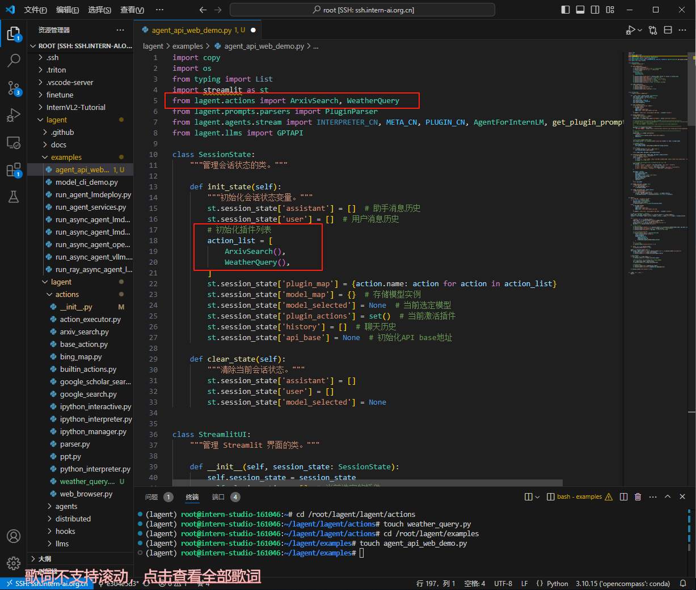

## 6.将`api_key`写入环境变量

```bash
# 书生·浦语 API 
export token='aaaaaaaaa'
# 和风天气 API
export weather_token='bbbbbbbbbb'
```

## 7.运行web程序`agent_api_web_demo.py`

```bash
streamlit run agent_api_web_demo.py
```

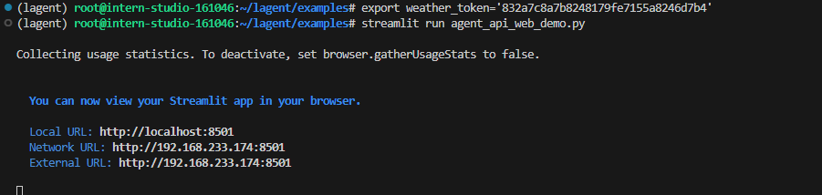

## 8.对话查看运行结果


# 任务二：使用 Lagent 复现文档中“Multi-Agents博客写作系统的搭建”

## 1.创建`multi_agents_api_web_demo.py`

```bash
conda activate lagent
cd /root/lagent/examples
touch multi_agents_api_web_demo.py
```

```python
import os
import asyncio
import json
import re
import requests
import streamlit as st

from lagent.agents import Agent
from lagent.prompts.parsers import PluginParser
from lagent.agents.stream import PLUGIN_CN, get_plugin_prompt
from lagent.schema import AgentMessage
from lagent.actions import ArxivSearch
from lagent.hooks import Hook
from lagent.llms import GPTAPI

YOUR_TOKEN_HERE = os.getenv("token")
if not YOUR_TOKEN_HERE:
    raise EnvironmentError("未找到环境变量 'token'，请设置后再运行程序。")

# Hook类，用于对消息添加前缀
class PrefixedMessageHook(Hook):
    def __init__(self, prefix, senders=None):
        """
        初始化Hook
        :param prefix: 消息前缀
        :param senders: 指定发送者列表
        """
        self.prefix = prefix
        self.senders = senders or []

    def before_agent(self, agent, messages, session_id):
        """
        在代理处理消息前修改消息内容
        :param agent: 当前代理
        :param messages: 消息列表
        :param session_id: 会话ID
        """
        for message in messages:
            if message.sender in self.senders:
                message.content = self.prefix + message.content

class AsyncBlogger:
    """博客生成类，整合写作者和批评者。"""

    def __init__(self, model_type, api_base, writer_prompt, critic_prompt, critic_prefix='', max_turn=2):
        """
        初始化博客生成器
        :param model_type: 模型类型
        :param api_base: API 基地址
        :param writer_prompt: 写作者提示词
        :param critic_prompt: 批评者提示词
        :param critic_prefix: 批评消息前缀
        :param max_turn: 最大轮次
        """
        self.model_type = model_type
        self.api_base = api_base
        self.llm = GPTAPI(
            model_type=model_type,
            api_base=api_base,
            key=YOUR_TOKEN_HERE,
            max_new_tokens=4096,
        )
        self.plugins = [dict(type='lagent.actions.ArxivSearch')]
        self.writer = Agent(
            self.llm,
            writer_prompt,
            name='写作者',
            output_format=dict(
                type=PluginParser,
                template=PLUGIN_CN,
                prompt=get_plugin_prompt(self.plugins)
            )
        )
        self.critic = Agent(
            self.llm,
            critic_prompt,
            name='批评者',
            hooks=[PrefixedMessageHook(critic_prefix, ['写作者'])]
        )
        self.max_turn = max_turn

    async def forward(self, message: AgentMessage, update_placeholder):
        """
        执行多阶段博客生成流程
        :param message: 初始消息
        :param update_placeholder: Streamlit占位符
        :return: 最终优化的博客内容
        """
        step1_placeholder = update_placeholder.container()
        step2_placeholder = update_placeholder.container()
        step3_placeholder = update_placeholder.container()

        # 第一步：生成初始内容
        step1_placeholder.markdown("**Step 1: 生成初始内容...**")
        message = self.writer(message)
        if message.content:
            step1_placeholder.markdown(f"**生成的初始内容**:\n\n{message.content}")
        else:
            step1_placeholder.markdown("**生成的初始内容为空，请检查生成逻辑。**")

        # 第二步：批评者提供反馈
        step2_placeholder.markdown("**Step 2: 批评者正在提供反馈和文献推荐...**")
        message = self.critic(message)
        if message.content:
            # 解析批评者反馈
            suggestions = re.search(r"1\. 批评建议：\n(.*?)2\. 推荐的关键词：", message.content, re.S)
            keywords = re.search(r"2\. 推荐的关键词：\n- (.*)", message.content)
            feedback = suggestions.group(1).strip() if suggestions else "未提供批评建议"
            keywords = keywords.group(1).strip() if keywords else "未提供关键词"

            # Arxiv 文献查询
            arxiv_search = ArxivSearch()
            arxiv_results = arxiv_search.get_arxiv_article_information(keywords)

            # 显示批评内容和文献推荐
            message.content = f"**批评建议**:\n{feedback}\n\n**推荐的文献**:\n{arxiv_results}"
            step2_placeholder.markdown(f"**批评和文献推荐**:\n\n{message.content}")
        else:
            step2_placeholder.markdown("**批评内容为空，请检查批评逻辑。**")

        # 第三步：写作者根据反馈优化内容
        step3_placeholder.markdown("**Step 3: 根据反馈改进内容...**")
        improvement_prompt = AgentMessage(
            sender="critic",
            content=(
                f"根据以下批评建议和推荐文献对内容进行改进：\n\n"
                f"批评建议：\n{feedback}\n\n"
                f"推荐文献：\n{arxiv_results}\n\n"
                f"请优化初始内容，使其更加清晰、丰富，并符合专业水准。"
            ),
        )
        message = self.writer(improvement_prompt)
        if message.content:
            step3_placeholder.markdown(f"**最终优化的博客内容**:\n\n{message.content}")
        else:
            step3_placeholder.markdown("**最终优化的博客内容为空，请检查生成逻辑。**")

        return message

def setup_sidebar():
    """设置侧边栏，选择模型。"""
    model_name = st.sidebar.text_input('模型名称：', value='internlm2.5-latest')
    api_base = st.sidebar.text_input(
        'API Base 地址：', value='https://internlm-chat.intern-ai.org.cn/puyu/api/v1/chat/completions'
    )
    
    return model_name, api_base
    
def main():
    """
    主函数：构建Streamlit界面并处理用户交互
    """
    st.set_page_config(layout='wide', page_title='Lagent Web Demo', page_icon='🤖')
    st.title("多代理博客优化助手")

    model_type, api_base = setup_sidebar()
    topic = st.text_input('输入一个话题：', 'Self-Supervised Learning')
    generate_button = st.button('生成博客内容')

    if (
        'blogger' not in st.session_state or
        st.session_state['model_type'] != model_type or
        st.session_state['api_base'] != api_base
    ):
        st.session_state['blogger'] = AsyncBlogger(
            model_type=model_type,
            api_base=api_base,
            writer_prompt="你是一位优秀的AI内容写作者，请撰写一篇有吸引力且信息丰富的博客内容。",
            critic_prompt="""
                作为一位严谨的批评者，请给出建设性的批评和改进建议，并基于相关主题使用已有的工具推荐一些参考文献，推荐的关键词应该是英语形式，简洁且切题。
                请按照以下格式提供反馈：
                1. 批评建议：
                - （具体建议）
                2. 推荐的关键词：
                - （关键词1, 关键词2, ...）
            """,
            critic_prefix="请批评以下内容，并提供改进建议：\n\n"
        )
        st.session_state['model_type'] = model_type
        st.session_state['api_base'] = api_base

    if generate_button:
        update_placeholder = st.empty()

        async def run_async_blogger():
            message = AgentMessage(
                sender='user',
                content=f"请撰写一篇关于{topic}的博客文章，要求表达专业，生动有趣，并且易于理解。"
            )
            result = await st.session_state['blogger'].forward(message, update_placeholder)
            return result

        loop = asyncio.new_event_loop()
        asyncio.set_event_loop(loop)
        loop.run_until_complete(run_async_blogger())

if __name__ == '__main__':
    main()
```

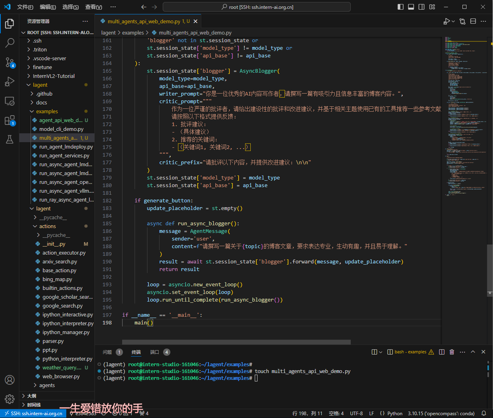

## 2.运行web程序`multi_agents_api_web_demo.py`

```bash
streamlit run multi_agents_api_web_demo.py
```

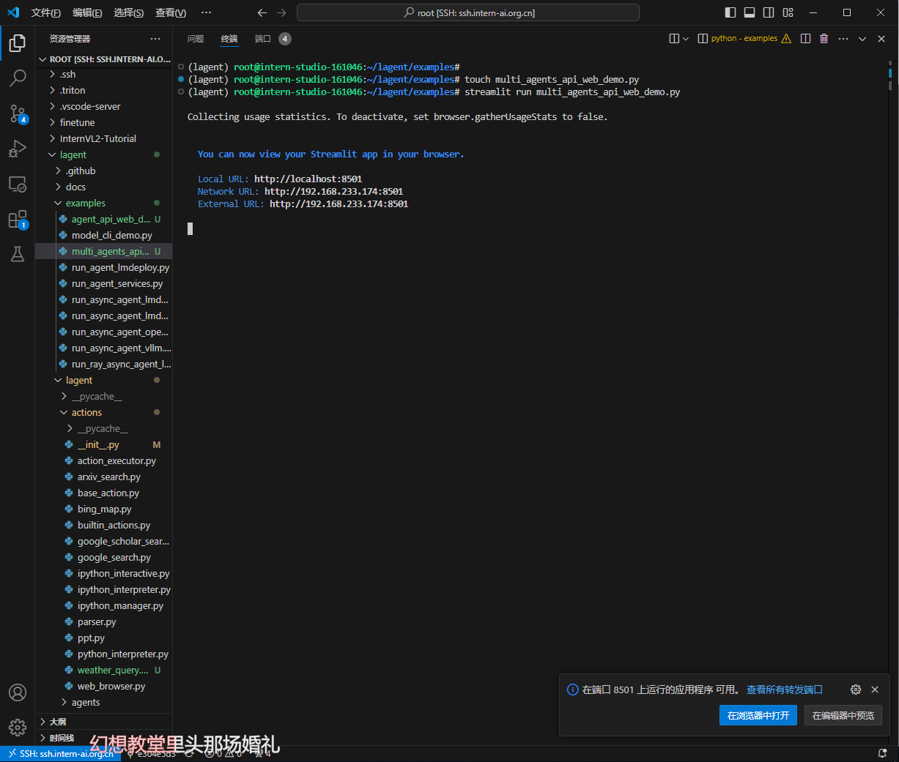

## 3.对话并查看运行结果


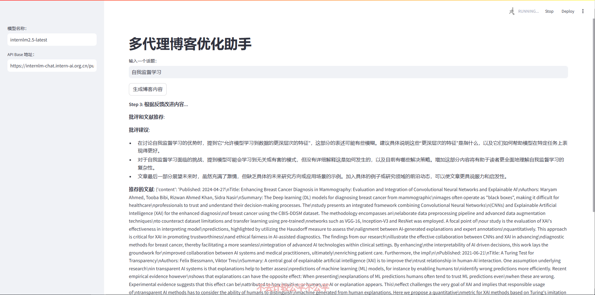

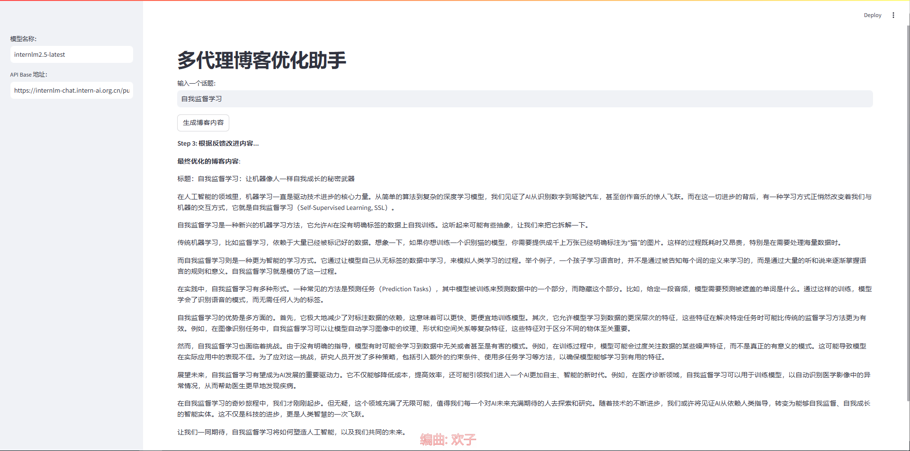

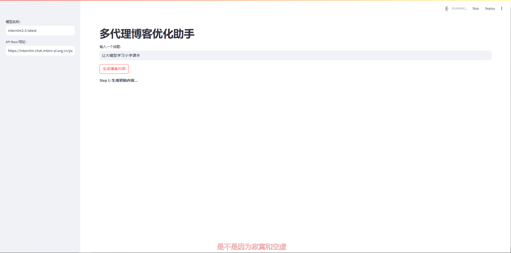

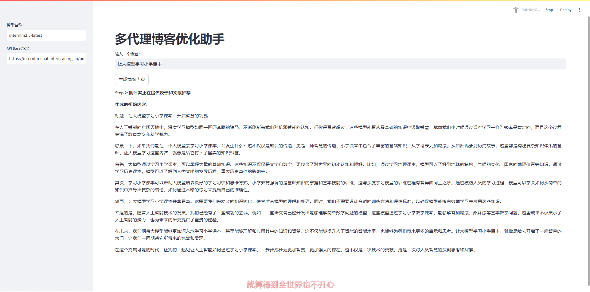

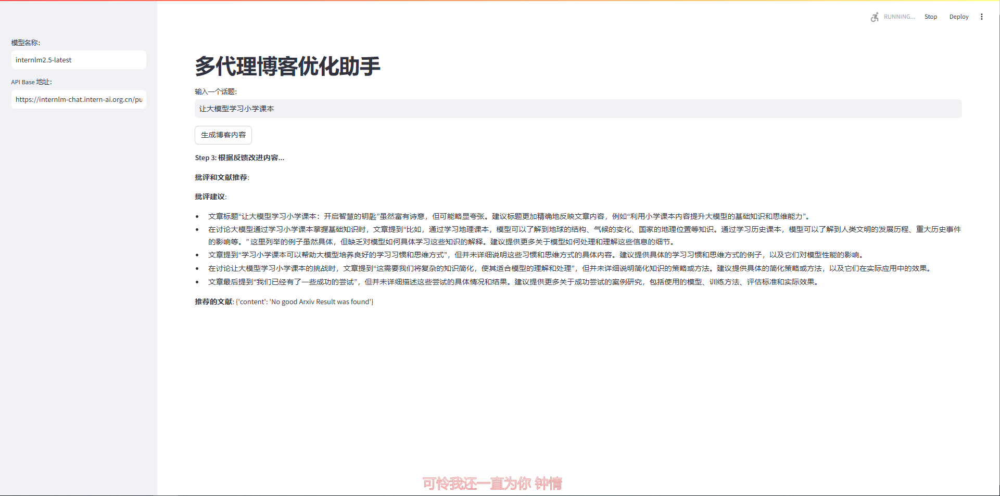

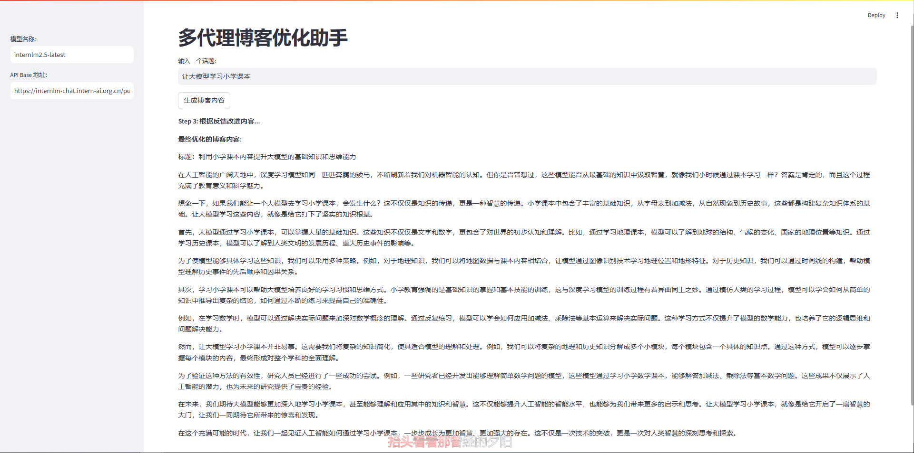


**The End.**