# 使用结合W4A16量化与kv cache量化的`internlm2_5-1_8b-chat`模型封装本地API并与大模型进行一次对话

> 使用结合W4A16量化与kv cache量化的`internlm2_5-1_8b-chat`模型封装本地API并与大模型进行一次对话，作业截图需包括显存占用情况与大模型回复，参考4.1 API开发(优秀学员必做)，**请注意2.2.3节与4.1节应使用作业版本命令。**

## 1.创建虚拟环境

```bash
conda create -n lmdeploy  python=3.10 -y
conda activate lmdeploy
```

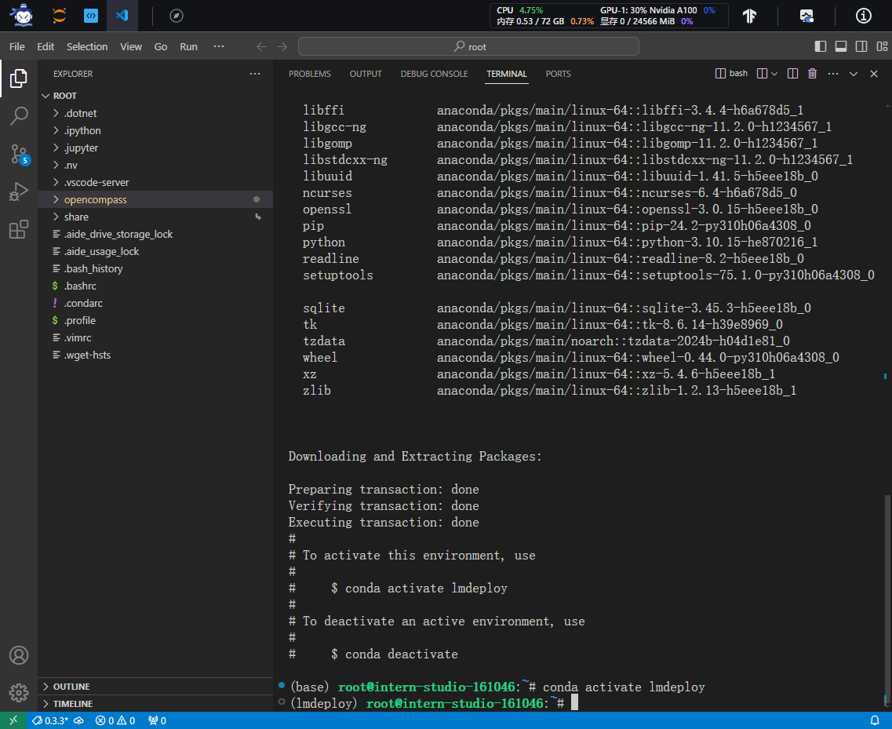

## 2.安装LMDeploy

```bash
conda install pytorch==2.1.2 torchvision==0.16.2 torchaudio==2.1.2 pytorch-cuda=12.1 -c pytorch -c nvidia -y
pip install timm==1.0.8 openai==1.40.3 lmdeploy[all]==0.5.3
```

## 3.获取模型`internlm2_5-1_8b-chat`

```bash
mkdir /root/models
ln -s /root/share/new_models/Shanghai_AI_Laboratory/internlm2_5-1_8b-chat /root/models
```

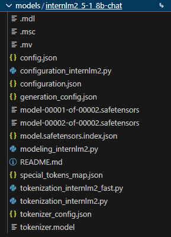

## 4.LMDeploy验证启动模型

```bash
lmdeploy chat /root/models/internlm2_5-1_8b-chat
```

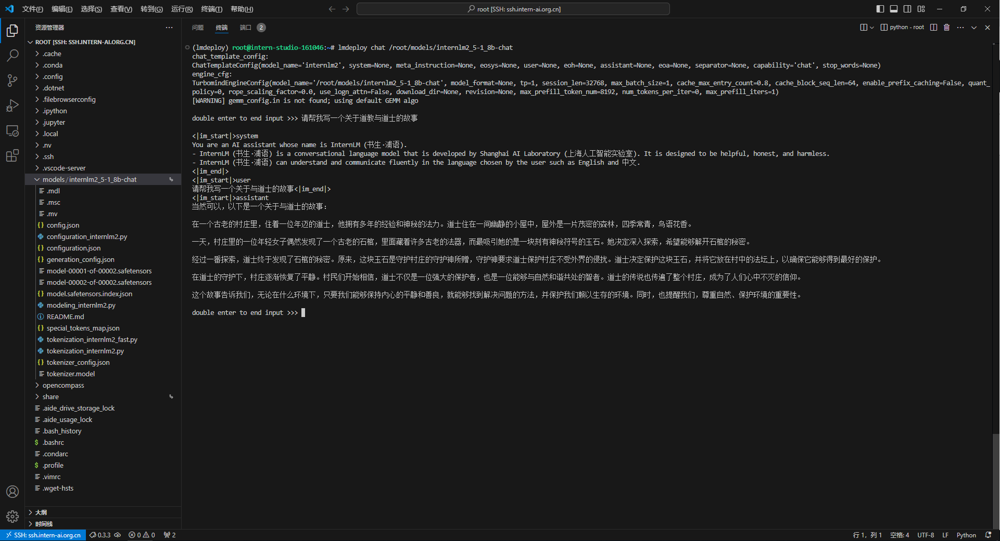

## 5.记录模型体积和显存占用

```bash
cd /root/share/new_models/Shanghai_AI_Laboratory/
du -sh *
```

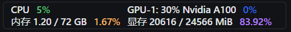

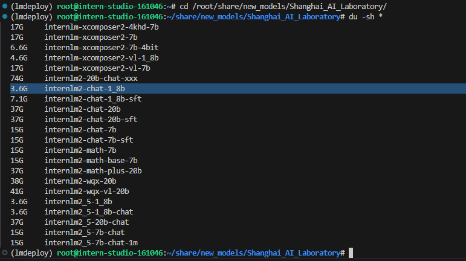

## 6.执行W4A16量化

```bash
pip install datasets==2.19.2

lmdeploy lite auto_awq \
   /root/models/internlm2_5-1_8b-chat \
  --calib-dataset 'ptb' \
  --calib-samples 128 \
  --calib-seqlen 2048 \
  --w-bits 4 \
  --w-group-size 128 \
  --batch-size 1 \
  --search-scale False \
  --work-dir /root/models/internlm2_5-1_8b-chat-w4a16-4bit
```

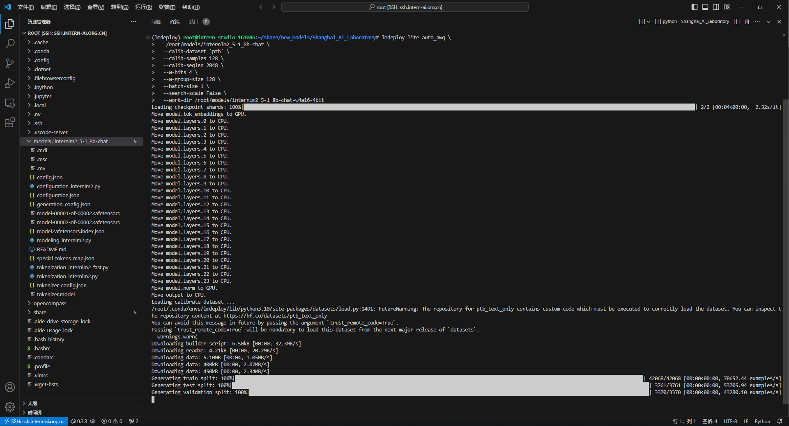

## 7.量化结束，记录量化后模型体积和现存占用

```bash
cd /root/models/
du -sh *

lmdeploy chat /root/models/internlm2_5-1_8b-chat-w4a16-4bit/ --model-format awq
```

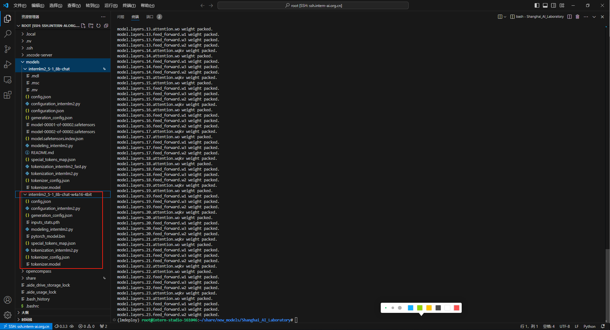

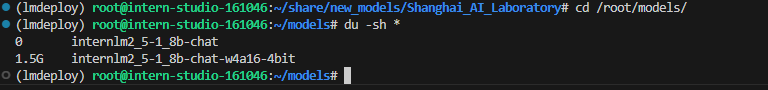

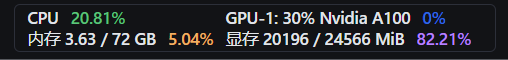

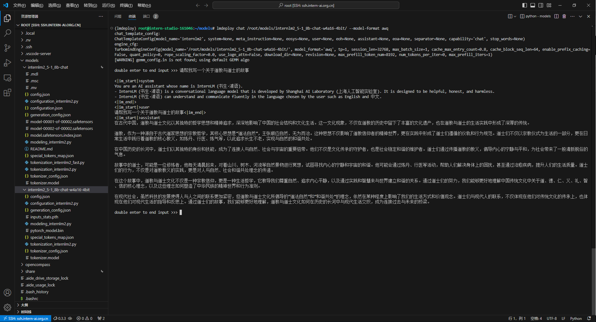

## 8.LMDeploy API部署W4A16 量化+ KV cache 量化`internlm2_5-1_8b-chat`

```bash
lmdeploy serve api_server \
    /root/models/internlm2_5-1_8b-chat-w4a16-4bit/ \
    --model-format awq \
    --quant-policy 4 \
    --cache-max-entry-count 0.4\
    --server-name 0.0.0.0 \
    --server-port 23333 \
    --tp 1
```

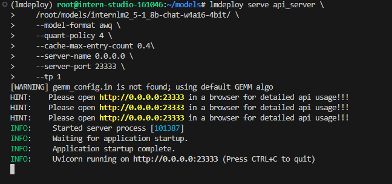

## 9.记录显存占用

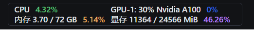

## 10.以Gradio网页形式连接API服务器

新建终端

```bash
conda activate lmdeploy
lmdeploy serve gradio http://localhost:23333 \
    --server-name 0.0.0.0 \
    --server-port 6006
```

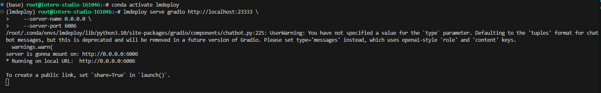

## 11.本地浏览器访问http://localhost:6006/

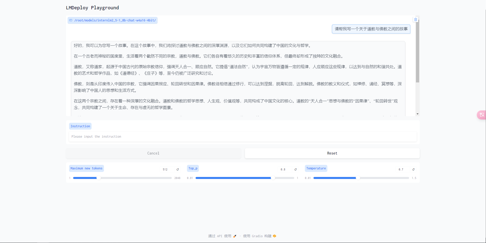


# 使用Function call功能让大模型完成一次简单的"加"与"乘"函数调用

> 使用Function call功能让大模型完成一次简单的"加"与"乘"函数调用，作业截图需包括大模型回复的工具调用情况，参考4.2 Function call(选做)

## 1.LMDeploy API部署W4A16 量化+ KV cache 量化`internlm2_5-1_8b-chat`

```bash
conda activate lmdeploy
lmdeploy serve api_server \
    /root/models/internlm2_5-1_8b-chat\
    --model-format hf \
    --quant-policy 0 \
    --server-name 0.0.0.0 \
    --server-port 23333 \
    --tp 1
```

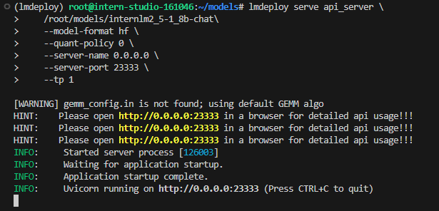

## 2.新建终端，创建`internlm2_5_func.py`

```bash
conda activate lmdeploy
touch /root/internlm2_5_func.py
```

```python
from openai import OpenAI


def add(a: int, b: int):
    return a + b


def mul(a: int, b: int):
    return a * b


tools = [{
    'type': 'function',
    'function': {
        'name': 'add',
        'description': 'Compute the sum of two numbers',
        'parameters': {
            'type': 'object',
            'properties': {
                'a': {
                    'type': 'int',
                    'description': 'A number',
                },
                'b': {
                    'type': 'int',
                    'description': 'A number',
                },
            },
            'required': ['a', 'b'],
        },
    }
}, {
    'type': 'function',
    'function': {
        'name': 'mul',
        'description': 'Calculate the product of two numbers',
        'parameters': {
            'type': 'object',
            'properties': {
                'a': {
                    'type': 'int',
                    'description': 'A number',
                },
                'b': {
                    'type': 'int',
                    'description': 'A number',
                },
            },
            'required': ['a', 'b'],
        },
    }
}]
messages = [{'role': 'user', 'content': 'Compute (3+5)*2'}]

client = OpenAI(api_key='YOUR_API_KEY', base_url='http://0.0.0.0:23333/v1')
model_name = client.models.list().data[0].id
response = client.chat.completions.create(
    model=model_name,
    messages=messages,
    temperature=0.8,
    top_p=0.8,
    stream=False,
    tools=tools)
print(response)
func1_name = response.choices[0].message.tool_calls[0].function.name
func1_args = response.choices[0].message.tool_calls[0].function.arguments
func1_out = eval(f'{func1_name}(**{func1_args})')
print(func1_out)

messages.append({
    'role': 'assistant',
    'content': response.choices[0].message.content
})
messages.append({
    'role': 'environment',
    'content': f'3+5={func1_out}',
    'name': 'plugin'
})
response = client.chat.completions.create(
    model=model_name,
    messages=messages,
    temperature=0.8,
    top_p=0.8,
    stream=False,
    tools=tools)
print(response)
func2_name = response.choices[0].message.tool_calls[0].function.name
func2_args = response.choices[0].message.tool_calls[0].function.arguments
func2_out = eval(f'{func2_name}(**{func2_args})')
print(func2_out)
```

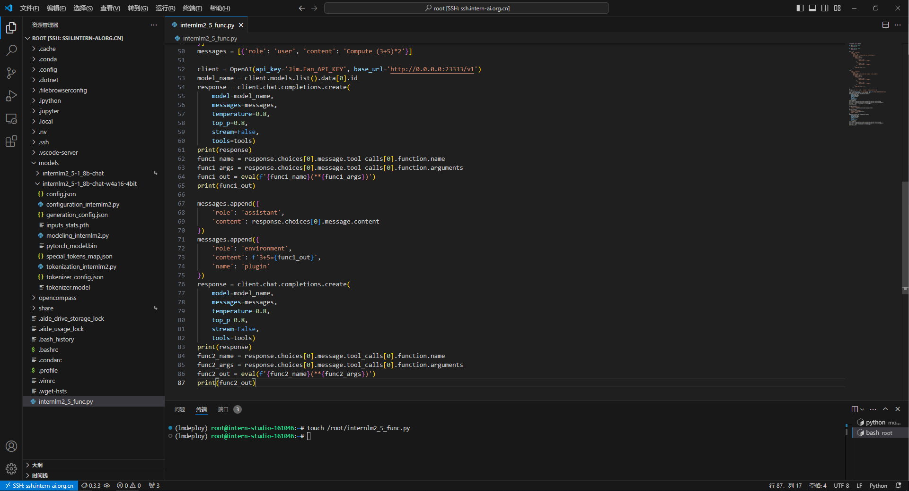

## 3.运行`internlm2_5_func.py`并查看结果

```bash
python /root/internlm2_5_func.py
```

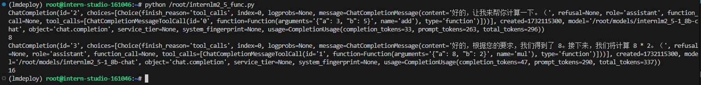


**The End.**
