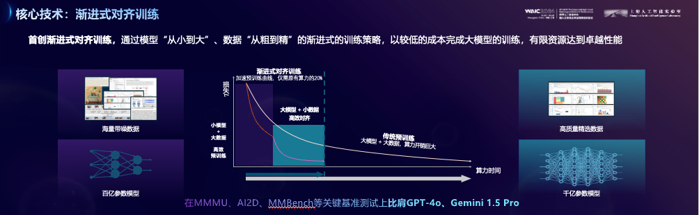

# Q1:理解多模态大模型的常见设计模式，可以大概讲出多模态大模型的工作原理。

## 多模态大模型的常见设计模式

1. **共享表示学习**：
   - 多模态模型通过共享的潜在空间（latent space）来学习不同模态（如文本、图像、音频等）的表示。这种方式使得不同模态之间的特征可以相互影响和增强。
2. **交互式学习**：
   - 模型在处理不同模态时，允许模态之间的交互。例如，文本和图像可以通过注意力机制互相影响，提升理解和生成的效果。
3. **层次化模型**：
   - 模型的结构可以分为多个层次，每个层次专注于不同的模态或特征。例如，底层处理低级特征（如边缘、颜色），而高层则处理语义信息（如对象识别、情感分析）。
4. **联合训练**：
   - 通过联合训练，让模型在同一训练过程中同时学习多个模态的任务。这种方式可以提高模型的泛化能力。
5. **模态特定的模块**：
   - 对于每种模态，设计特定的处理模块，例如图像处理模块和文本处理模块，然后将这些模块的输出结合起来进行最终的决策。

## 多模态大模型的工作原理

1. **数据预处理**：
   - 不同模态的数据需要进行适当的预处理。例如，图像可以进行归一化和增强，文本需要分词和编码。
2. **特征提取**：
   - 使用特定的神经网络架构（如卷积神经网络（CNN）用于图像，循环神经网络（RNN）或变压器（Transformer）用于文本）提取各个模态的特征。
3. **融合机制**：
   - 将不同模态的特征进行融合，常用的方法包括：
     - **早期融合**：在特征提取后立即将不同模态的特征合并。
     - **晚期融合**：各模态独立处理后，再将结果结合。
     - **中间融合**：在特征提取的中间层进行融合。
4. **任务学习**：
   - 基于融合后的特征进行任务学习，如分类、生成等。模型通过反向传播优化参数，以最小化损失函数。
5. **推理与生成**：
   - 在推理阶段，模型能够根据输入的不同模态生成输出，比如根据文本生成图像，或根据图像生成描述。


# Q2:了解InternVL2的设计模式，可以大概描述InternVL2的模型架构和训练流程。

> [InternVL家族：通过开源组件缩小与商业多模态模型的差距 —— GPT-4o的开源替代方案](https://github.com/OpenGVLab/InternVL/blob/main/README_zh.md)
>
> [Mini-InternVL 2.0: A Flexible-Transfer Pocket Multimodal Model with 5% Parameters and 90% Performance](https://internvl.github.io/blog/2024-10-21-Mini-InternVL-2.0/)
>
> [Introduction of InternVL2 Series](https://internvl.readthedocs.io/en/latest/internvl2.0/introduction.html)
>
> [从图像到万象，InternVL 2.0 书生·万象多模态大模型发布！](https://zhuanlan.zhihu.com/p/706547971)
>
> [Mini-InternVL: A Flexible-Transfer Pocket Multimodal Model with 5% Parameters and 90% Performance](https://arxiv.org/abs/2410.16261)

## InternVL2的设计模式

InternVL2采用了LLaVA式的架构设计，即ViT-MLP-LLM的结构：

- **InternLM2-20B**：作为语言模型部分。
- **InternViT-6B**：作为视觉模型部分。
- **MLP**：作为连接视觉和语言模型的中间层。


## InternVL2的模型架构

1. **Dynamic High Resolution**：InternVL2具有动态高分辨率的预处理模块，使得ViT模型能够获取更细节的图像信息，提高视觉特征的表达能力。
2. **InternViT**：InternViT相比原来的ViT，参数量扩展到了6B，并且在不同版本中进行了创新，如分辨率从224扩展到448，以及动态分辨率的支持。
3. **Pixel Shuffle**：Pixel Shuffle操作用于减少模型在处理时所需的视觉令牌数量，提高处理高分辨率图像时的计算效率。
4. **Multitask output**：支持多种输出格式，如图像、边界框和掩模，具有广泛的多功能性。

## InternVL2的训练流程

InternVL2的训练流程分为两个阶段：

1. **Stage-1（预训练）**：对MLP参数进行更新，使用的数据集包括从多个来源收集的数据，涵盖多个任务，如图像描述、视觉问答、检测、定位和OCR等。
2. **Stage-2（微调）**：全参数更新，使用的数据集基于InternVL 1.5中使用的500万高质量双语数据集构建，包括视频数据和医疗数据等。



此外，InternVL2还采用了渐进式对齐的训练策略，实现了与LLM原生对齐的视觉基座模型，渐进式训练策略使得模型从小到大，数据从粗到细训练，以较低成本完成大模型的训练。


# Q3:了解LMDeploy部署多模态大模型的核心代码，并运行提供的gradio代码，在UI界面体验与InternVL2的对话。

## 1.lmdeploy推理的核心代码

```python
###通过pipeline.chat 接口来构造多轮对话管线

## 1.导入相关依赖包
from lmdeploy import pipeline, TurbomindEngineConfig, GenerationConfig
from lmdeploy.vl import load_image

## 2.使用你的模型初始化推理管线
model_path = "your_model_path"
pipe = pipeline(model_path,
                backend_config=TurbomindEngineConfig(session_len=8192))
                
## 3.读取图片（此处使用PIL读取也行）
image = load_image('your_image_path')

## 4.配置推理参数
gen_config = GenerationConfig(top_p=0.8, temperature=0.8)
## 5.利用 pipeline.chat 接口 进行对话，需传入生成参数
sess = pipe.chat(('describe this image', image), gen_config=gen_config)
print(sess.response.text)
## 6.之后的对话轮次需要传入之前的session，以告知模型历史上下文
sess = pipe.chat('What is the woman doing?', session=sess, gen_config=gen_config)
print(sess.response.text)
```

## 2.LMDeploy环境配置

```bash
conda create -n lmdeploy python=3.10 -y
conda activate lmdeploy
pip install lmdeploy gradio==4.44.1 timm==1.0.9
```

## 3.网页应用部署体验与InternVL2的对话

拉取github仓库https://github.com/Control-derek/InternVL2-Tutorial.git

```bash
git clone https://github.com/Control-derek/InternVL2-Tutorial.git
cd InternVL2-Tutorial
```

修改`demo.py`中模型路径


启动demo

```bash
python demo.py
```


访问http://127.0.0.1:1096/


# Q4:了解XTuner，并利用给定数据集微调InternVL2-2B后，再次启动UI界面，体验模型美食鉴赏能力的变化。

## 1.安装与deepspeed集成的xtuner和相关包

```bash
pip install -U 'xtuner[deepspeed]' timm==1.0.9
pip install torch==2.4.1 torchvision==0.19.1 torchaudio==2.4.1 --index-url https://download.pytorch.org/whl/cu121
pip install transformers==4.39.0
```

## 2.准备基本配置文件

```bash
cd ~
mkdir finetune && cd finetune
cp /root/InternVL2-Tutorial/xtuner_config/internvl_v2_internlm2_2b_lora_finetune_food.py ./
```

## 3.准备数据集

```bash
mkdir data && cd data
cp -r /root/share/datasets/FoodieQA ./
```


## 4.修改配置文件`internvl_v2_internlm2_2b_lora_finetune_food.py`

```python
#######################################################################
#                          PART 1  Settings                           #
#######################################################################
# Model
path = '/root/share/new_models/OpenGVLab/InternVL2-2B'

# Data
-  data_root = '/root/share/datasets/FoodieQA/' 
+  data_root = '/root/finetune/data/FoodieQA/'

data_path = data_root + 'sivqa_llava.json'
image_folder = data_root  # your image folder path
prompt_template = PROMPT_TEMPLATE.internlm2_chat
max_length = 8192
```


## 5.启动训练

```bash
cd ~/finetune
xtuner train ./internvl_v2_internlm2_2b_lora_finetune_food.py --deepspeed deepspeed_zero2 --work-dir ./work_dirs/assistTuner
```


## 6.转换模型

```bash
cd ~/finetune
touch ./convert_to_official.py
```

```python
import argparse
import os.path as osp

import torch
from mmengine.config import Config
from transformers import AutoTokenizer

from xtuner.model.utils import LoadWoInit
from xtuner.registry import BUILDER


def convert_to_official(config, trained_path, save_path):
    cfg = Config.fromfile(config)
    cfg.model.pretrained_pth = trained_path
    cfg.model.quantization_vit = False
    cfg.model.quantization_llm = False

    with LoadWoInit():
        model = BUILDER.build(cfg.model)
    model.to(torch.bfloat16)

    if model.use_visual_encoder_lora:
        vision_model = model.model.vision_model.merge_and_unload()
        model.model.vision_model = vision_model

    if model.use_llm_lora:
        language_model = model.model.language_model.merge_and_unload()
        model.model.language_model = language_model

    model.model.save_pretrained(save_path)

    tokenizer = AutoTokenizer.from_pretrained(
        cfg.model.model_path, trust_remote_code=True)
    tokenizer.save_pretrained(save_path)

    print(model)


def main():
    parser = argparse.ArgumentParser(
        description='Convert the pth model to HuggingFace model')
    parser.add_argument('config', help='config file name or path.')
    parser.add_argument('trained_model_pth', help='The trained model path.')
    parser.add_argument(
        'save_path', help='The path to save the converted model.')
    args = parser.parse_args()

    if osp.realpath(args.trained_model_pth) == osp.realpath(args.save_path):
        raise ValueError(
            'The trained path and save path should not be the same.')

    convert_to_official(args.config, args.trained_model_pth, args.save_path)


if __name__ == '__main__':
    main()
```


```bash
python ./convert_to_official.py ./work_dirs/assistTuner/internvl_v2_internlm2_2b_lora_finetune_food.py ./work_dirs/assistTuner/iter_640.pth ./work_dirs/convert/
```


## 7.修改`demo.py`中模型路径为转换后的模型地址

```bash
cd ~/InternVL2-Tutorial/
```

```python
-  MODEL_PATH = "/root/share/new_models/OpenGVLab/InternVL2-2B"
+  MODEL_PATH = "/root/finetune/work_dirs/convert"
```


## 8.启动demo运行训练后的模型

```bash
# pip install --upgrade transformers

python ./denmo.py
```


## 9.本地访问`http://127.0.0.1:1096/`


之前不认识的现在都认识了~~~~


**The End.**
