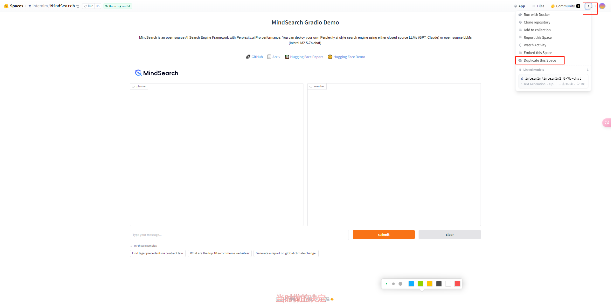
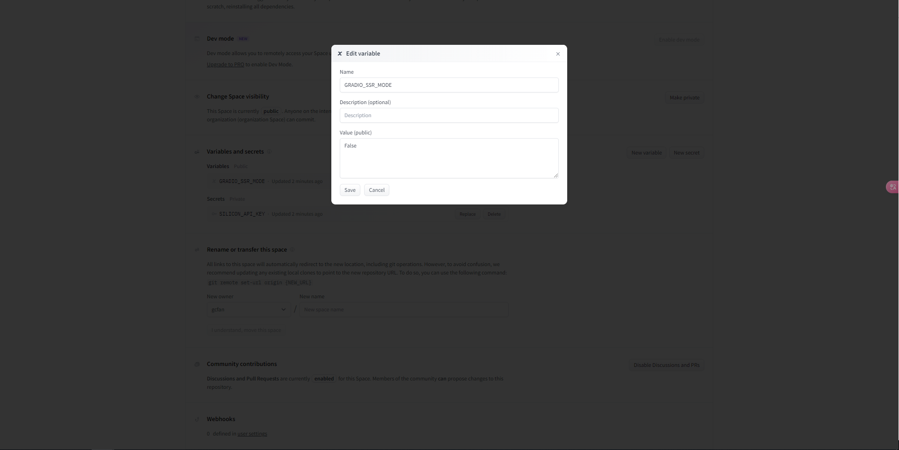

# 任务一：部署MindSearch到 hugging face Spaces上

> 在 [官方的MindSearch页面](https://huggingface.co/spaces/internlm/MindSearch) 复制Spaces应用到自己的Spaces下，Space 名称中需要包含 MindSearch 关键词，请在必要的步骤以及成功的对话测试结果当中

## 一、找到InternLM官方部署的[MindSearch Spaces应用](https://huggingface.co/spaces/internlm/MindSearch)

[MindSearch Spaces](https://huggingface.co/spaces/internlm/MindSearch)


## 二、Duplicate this Space



## 三、填入Space name、Silicon_api_key，选择好Space hardware

> Silicon_api_key为硅基流动的API。
>
> 首先，打开它的[登录界面](https://account.siliconflow.cn/login)来注册硅基流动的账号（如果注册过，则直接登录即可）。 在完成注册后，打开[api key页面](https://cloud.siliconflow.cn/account/ak)来准备 API Key。
>
> 首先创建新 API 密钥，然后点击密钥进行复制，以备后续使用。
>
> 


## 四、点击Duplicate Space，等待space部署结束


## 五、Space应用启动成功


## 六、测试结果

```tex
# input
What are the top 10 e-commerce websites?
```


# 任务二：部署MindSearch stremlit版本到Hugging Face上

## 1、创建Space


## 2、填入Space信息，Space SDK选择Streamlit


## 3、Creat Space


## 4、克隆MindSearch仓库

```shell
git clone https://github.com/InternLM/MindSearch
```


## 5、克隆space仓库

```shell
git clone https://huggingface.co/spaces/gcfan/L2G6000_4147_MindSearch_streamlit
```


## 6、复制`MindSearch`到`L2G6000_4147_MindSearch_streamlit`

```shell
mkdir ./L2G6000_4147_MindSearch_streamlit/frontend/ && mkdir ./L2G6000_4147_MindSearch_streamlit/mindsearch && cp -r ./MindSearch/frontend/* ./L2G6000_4147_MindSearch_streamlit/frontend/ && cp -r ./MindSearch/mindsearch/* ./L2G6000_4147_MindSearch_streamlit/mindsearch/ && cp ./MindSearch/requirements.txt ./L2G6000_4147_MindSearch_streamlit/
```


## 7、复制`mindsearch_streamlit.py`为`app.py`

```shell
cd L2G6000_4147_MindSearch_streamlit\
cp frontend/mindsearch_streamlit.py app.py
```


## 8.修改`app.py`

```python
import json
import tempfile
import os
import sys
import requests
import streamlit as st
from lagent.schema import AgentStatusCode
from pyvis.network import Network

os.system("pip install tenacity")
os.system("python -m mindsearch.app --lang en --model_format internlm_silicon --search_engine DuckDuckGoSearch &")

# Function to create the network graph
def create_network_graph(nodes, adjacency_list):
    net = Network(height="500px", width="60%", bgcolor="white", font_color="black")
    for node_id, node_content in nodes.items():
        net.add_node(node_id, label=node_id, title=node_content, color="#FF5733", size=25)
    for node_id, neighbors in adjacency_list.items():
        for neighbor in neighbors:
            if neighbor["name"] in nodes:
                net.add_edge(node_id, neighbor["name"])
    net.show_buttons(filter_=["physics"])
    return net


# Function to draw the graph and return the HTML file path
def draw_graph(net):
    path = tempfile.mktemp(suffix=".html")
    net.save_graph(path)
    return path


def streaming(raw_response):
    for chunk in raw_response.iter_lines(chunk_size=8192, decode_unicode=False, delimiter=b"\n"):
        if chunk:
            decoded = chunk.decode("utf-8")
            if decoded == "\r":
                continue
            if decoded[:6] == "data: ":
                decoded = decoded[6:]
            elif decoded.startswith(": ping - "):
                continue
            response = json.loads(decoded)
            yield (
                response["current_node"],
                (
                    response["response"]["formatted"]["node"][response["current_node"]]["response"]
                    if response["current_node"]
                    else response["response"]
                ),
                response["response"]["formatted"]["adjacency_list"],
            )


# Initialize Streamlit session state
if "queries" not in st.session_state:
    st.session_state["queries"] = []
    st.session_state["responses"] = []
    st.session_state["graphs_html"] = []
    st.session_state["nodes_list"] = []
    st.session_state["adjacency_list_list"] = []
    st.session_state["history"] = []
    st.session_state["already_used_keys"] = list()

# Set up page layout
st.set_page_config(layout="wide")
st.title("MindSearch-4147")


# Function to update chat
def update_chat(query):
    with st.chat_message("user"):
        st.write(query)
    if query not in st.session_state["queries"]:
        # Mock data to simulate backend response
        # response, history, nodes, adjacency_list
        st.session_state["queries"].append(query)
        st.session_state["responses"].append([])
        history = None
        # 暂不支持多轮
        # message = [dict(role='user', content=query)]

        url = "http://localhost:8002/solve"
        headers = {"Content-Type": "application/json"}
        data = {"inputs": query}
        raw_response = requests.post(
            url, headers=headers, data=json.dumps(data), timeout=20, stream=True
        )

        _nodes, _node_cnt = {}, 0
        for resp in streaming(raw_response):
            node_name, response, adjacency_list = resp
            for name in set(adjacency_list) | {
                val["name"] for vals in adjacency_list.values() for val in vals
            }:
                if name not in _nodes:
                    _nodes[name] = query if name == "root" else name
                elif response["stream_state"] == 0:
                    _nodes[node_name or "response"] = response["formatted"] and response[
                        "formatted"
                    ].get("thought")
            if len(_nodes) != _node_cnt or response["stream_state"] == 0:
                net = create_network_graph(_nodes, adjacency_list)
                graph_html_path = draw_graph(net)
                with open(graph_html_path, encoding="utf-8") as f:
                    graph_html = f.read()
                _node_cnt = len(_nodes)
            else:
                graph_html = None
            if "graph_placeholder" not in st.session_state:
                st.session_state["graph_placeholder"] = st.empty()
            if "expander_placeholder" not in st.session_state:
                st.session_state["expander_placeholder"] = st.empty()
            if graph_html:
                with st.session_state["expander_placeholder"].expander(
                    "Show Graph", expanded=False
                ):
                    st.session_state["graph_placeholder"]._html(graph_html, height=500)
            if "container_placeholder" not in st.session_state:
                st.session_state["container_placeholder"] = st.empty()
            with st.session_state["container_placeholder"].container():
                if "columns_placeholder" not in st.session_state:
                    st.session_state["columns_placeholder"] = st.empty()
                col1, col2 = st.session_state["columns_placeholder"].columns([2, 1])
                with col1:
                    if "planner_placeholder" not in st.session_state:
                        st.session_state["planner_placeholder"] = st.empty()
                    if "session_info_temp" not in st.session_state:
                        st.session_state["session_info_temp"] = ""
                    if not node_name:
                        if response["stream_state"] in [
                            AgentStatusCode.STREAM_ING,
                            AgentStatusCode.CODING,
                            AgentStatusCode.CODE_END,
                        ]:
                            content = response["formatted"]["thought"]
                            if response["formatted"]["tool_type"]:
                                action = response["formatted"]["action"]
                                if isinstance(action, dict):
                                    action = json.dumps(action, ensure_ascii=False, indent=4)
                                content += "\n" + action
                            st.session_state["session_info_temp"] = content.replace(
                                "<|action_start|><|interpreter|>\n", "\n"
                            )
                        elif response["stream_state"] == AgentStatusCode.CODE_RETURN:
                            # assert history[-1]["role"] == "environment"
                            st.session_state["session_info_temp"] += "\n" + response["content"]
                        st.session_state["planner_placeholder"].markdown(
                            st.session_state["session_info_temp"]
                        )
                        if response["stream_state"] == AgentStatusCode.CODE_RETURN:
                            st.session_state["responses"][-1].append(
                                st.session_state["session_info_temp"]
                            )
                            st.session_state["session_info_temp"] = ""
                    else:
                        st.session_state["planner_placeholder"].markdown(
                            st.session_state["responses"][-1][-1]
                            if not st.session_state["session_info_temp"]
                            else st.session_state["session_info_temp"]
                        )
                with col2:
                    if "selectbox_placeholder" not in st.session_state:
                        st.session_state["selectbox_placeholder"] = st.empty()
                    if "searcher_placeholder" not in st.session_state:
                        st.session_state["searcher_placeholder"] = st.empty()
                    if node_name:
                        selected_node_key = (
                            f"selected_node_{len(st.session_state['queries'])}_{node_name}"
                        )
                        if selected_node_key not in st.session_state:
                            st.session_state[selected_node_key] = node_name
                        if selected_node_key not in st.session_state["already_used_keys"]:
                            selected_node = st.session_state["selectbox_placeholder"].selectbox(
                                "Select a node:",
                                list(_nodes.keys()),
                                key=f"key_{selected_node_key}",
                                index=list(_nodes.keys()).index(node_name),
                            )
                            st.session_state["already_used_keys"].append(selected_node_key)
                        else:
                            selected_node = node_name
                        st.session_state[selected_node_key] = selected_node
                        node_info_key = f"{selected_node}_info"
                        if node_info_key not in st.session_state:
                            st.session_state[node_info_key] = [["thought", ""]]
                        if response["stream_state"] in [AgentStatusCode.STREAM_ING]:
                            content = response["formatted"]["thought"]
                            st.session_state[node_info_key][-1][1] = content.replace(
                                "<|action_start|><|plugin|>\n", "\n```json\n"
                            )
                        elif response["stream_state"] in [
                            AgentStatusCode.PLUGIN_START,
                            AgentStatusCode.PLUGIN_END,
                        ]:
                            thought = response["formatted"]["thought"]
                            action = response["formatted"]["action"]
                            if isinstance(action, dict):
                                action = json.dumps(action, ensure_ascii=False, indent=4)
                            content = thought + "\n```json\n" + action
                            if response["stream_state"] == AgentStatusCode.PLUGIN_RETURN:
                                content += "\n```"
                            st.session_state[node_info_key][-1][1] = content
                        elif (
                            response["stream_state"] == AgentStatusCode.PLUGIN_RETURN
                            and st.session_state[node_info_key][-1][1]
                        ):
                            try:
                                content = json.loads(response["content"])
                            except json.decoder.JSONDecodeError:
                                content = response["content"]
                            st.session_state[node_info_key].append(
                                [
                                    "observation",
                                    (
                                        content
                                        if isinstance(content, str)
                                        else f"```json\n{json.dumps(content, ensure_ascii=False, indent=4)}\n```"
                                    ),
                                ]
                            )
                        st.session_state["searcher_placeholder"].markdown(
                            st.session_state[node_info_key][-1][1]
                        )
                        if (
                            response["stream_state"] == AgentStatusCode.PLUGIN_RETURN
                            and st.session_state[node_info_key][-1][1]
                        ):
                            st.session_state[node_info_key].append(["thought", ""])
        if st.session_state["session_info_temp"]:
            st.session_state["responses"][-1].append(st.session_state["session_info_temp"])
            st.session_state["session_info_temp"] = ""
        # st.session_state['responses'][-1] = '\n'.join(st.session_state['responses'][-1])
        st.session_state["graphs_html"].append(graph_html)
        st.session_state["nodes_list"].append(_nodes)
        st.session_state["adjacency_list_list"].append(adjacency_list)
        st.session_state["history"] = history


def display_chat_history():
    for i, query in enumerate(st.session_state["queries"][-1:]):
        # with st.chat_message('assistant'):
        if st.session_state["graphs_html"][i]:
            with st.session_state["expander_placeholder"].expander("Show Graph", expanded=False):
                st.session_state["graph_placeholder"]._html(
                    st.session_state["graphs_html"][i], height=500
                )
            with st.session_state["container_placeholder"].container():
                col1, col2 = st.session_state["columns_placeholder"].columns([2, 1])
                with col1:
                    st.session_state["planner_placeholder"].markdown(
                        st.session_state["responses"][-1][-1]
                    )
                with col2:
                    selected_node_key = st.session_state["already_used_keys"][-1]
                    st.session_state["selectbox_placeholder"] = st.empty()
                    selected_node = st.session_state["selectbox_placeholder"].selectbox(
                        "Select a node:",
                        list(st.session_state["nodes_list"][i].keys()),
                        key=f"replay_key_{i}",
                        index=list(st.session_state["nodes_list"][i].keys()).index(
                            st.session_state[selected_node_key]
                        ),
                    )
                    st.session_state[selected_node_key] = selected_node
                    if (
                        selected_node not in ["root", "response"]
                        and selected_node in st.session_state["nodes_list"][i]
                    ):
                        node_info_key = f"{selected_node}_info"
                        for item in st.session_state[node_info_key]:
                            if item[0] in ["thought", "answer"]:
                                st.session_state["searcher_placeholder"] = st.empty()
                                st.session_state["searcher_placeholder"].markdown(item[1])
                            elif item[0] == "observation":
                                st.session_state["observation_expander"] = st.empty()
                                with st.session_state["observation_expander"].expander("Results"):
                                    st.write(item[1])
                        # st.session_state['searcher_placeholder'].markdown(st.session_state[node_info_key])


def clean_history():
    st.session_state["queries"] = []
    st.session_state["responses"] = []
    st.session_state["graphs_html"] = []
    st.session_state["nodes_list"] = []
    st.session_state["adjacency_list_list"] = []
    st.session_state["history"] = []
    st.session_state["already_used_keys"] = list()
    for k in st.session_state:
        if k.endswith("placeholder") or k.endswith("_info"):
            del st.session_state[k]


# Main function to run the Streamlit app
def main():
    st.sidebar.title("Model Control")
    col1, col2 = st.columns([4, 1])
    with col1:
        user_input = st.chat_input("Enter your query:")
    with col2:
        if st.button("Clear History"):
            clean_history()
    if user_input:
        update_chat(user_input)
    display_chat_history()


if __name__ == "__main__":
    main()

```

## 9.push到仓库

```shell
git add .
git commit -m "update L2G6000"
git push
```


## 10.设置环境变量

```tex
New Variables
name：GRADIO_SSR_MODE
Value：False

New Secrets
name：SILICON_API_KEY
Value：sk-tasXXXXXXXXXXXXXXXXXXXXXXXXXXXXXXXXXXX
```





## 11.程序运行


## 12.调试结果

```tex
# input
What are the top 10 e-commerce websites?
```


**The End.**

