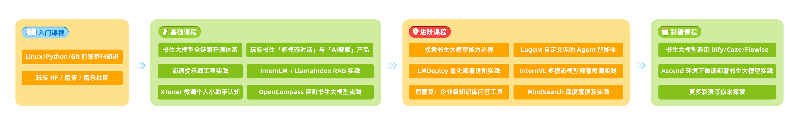
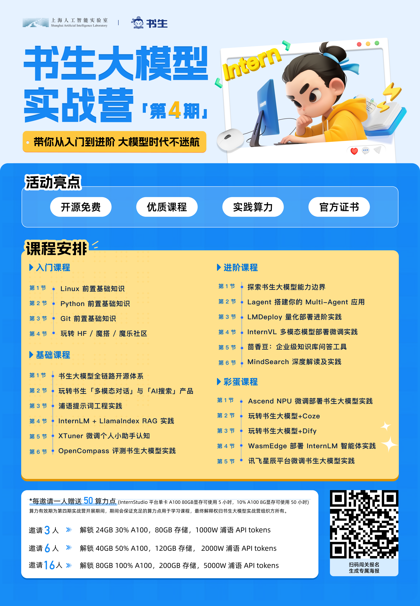

# 书生大模型实战营（第四期）学习笔记

##  特别鸣谢

感谢上海人工智能实验室（书生·浦语开源大模型）提供的免费学习算力、课程及机会！

[书生·浦语开源大模型](https://github.com/InternLM/InternLM)

[InternLM](https://github.com/InternLM/InternLM)

[书生大模型实战营（第四期）](https://github.com/InternLM/Tutorial)

## 1. 关卡

### 1.1. 入门关卡

|         | 关卡名称                 | 闯关完成 | 作业地址                                                     |
| :------ | :----------------------- | :------- | ------------------------------------------------------------ |
| 第 1 关 | Linux 前置基础           | 已完成   | [L0G1000](https://github.com/gcfan0813/InternLM-Study/tree/main/L0-%E5%85%A5%E9%97%A8%E5%B2%9B/L0G1000) |
| 第 2 关 | Python 前置基础          | 已完成   | [L0G2000](https://github.com/gcfan0813/InternLM-Study/tree/main/L0-%E5%85%A5%E9%97%A8%E5%B2%9B/L0G2000) |
| 第 3 关 | Git 前置基础             | 已完成   | [L0G3000](https://github.com/gcfan0813/InternLM-Study/tree/main/L0-%E5%85%A5%E9%97%A8%E5%B2%9B/L0G3000) |
| 第 4 关 | 玩转「HF/魔搭/魔乐」平台 | 已完成   | [L0G4000](https://github.com/gcfan0813/InternLM-Study/tree/main/L0-%E5%85%A5%E9%97%A8%E5%B2%9B/L0G4000) |

### 1.2. 基础关卡

|         | 关卡名称                               | 闯关完成 | 作业地址                                                     |
| :------ | :------------------------------------- | :------- | ------------------------------------------------------------ |
| 第 1 关 | 书生大模型全链路开源体系               | 已完成   | [L1G1000](https://github.com/gcfan0813/InternLM-Study/tree/main/L1-%E5%9F%BA%E7%A1%80%E5%B2%9B/L1G1000) |
| 第 2 关 | 玩转书生「多模态对话」和「AI搜索」产品 | 已完成   | [L1G2000](https://github.com/gcfan0813/InternLM-Study/tree/main/L1-%E5%9F%BA%E7%A1%80%E5%B2%9B/L1G2000) |
| 第 3 关 | 浦语提示词工程实践                     | 已完成   | [L1G3000](https://github.com/gcfan0813/InternLM-Study/tree/main/L1-%E5%9F%BA%E7%A1%80%E5%B2%9B/L1G3000) |
| 第 4 关 | InternLM + LlamaIndex RAG 实践         | 未完成   |                                                              |
| 第 6 关 | XTuner 微调个人小助手认知              | 未完成   |                                                              |
| 第 7 关 | OpenCompass 评测书生大模型实践         | 未完成   |                                                              |

### 1.3. 进阶关卡

|         | 关卡名称                        | 闯关完成 |
| :------ | :------------------------------ | :------- |
| 第 1 关 | 探索书生大模型能力边界          | 未完成   |
| 第 2 关 | Lagent 自定义你的 Agent 智能体  | 未完成   |
| 第 3 关 | LMDeploy 量化部署进阶实践       | 未完成   |
| 第 4 关 | InternVL 多模态模型部署微调实践 | 未完成   |
| 第 5 关 | 茴香豆：企业级知识库问答工具    | 未完成   |
| 第 6 关 | MindSearch深度解析及实践        | 未完成   |

### 1.4. 彩蛋岛

|         | 关卡名称                            | 闯关完成 |
| :------ | :---------------------------------- | :------- |
| 第 1 关 | 书生大模型遇见 coze/dify/flowise    | 未完成   |
| 第 2 关 | Ascend 环境下微调部署书生大模型实践 | 未完成   |

## 2. 证书

**等我得一个贴一个！！！！**

## 3. 书生共学计划

**扫码加入我们！现在！立刻！马上！**

