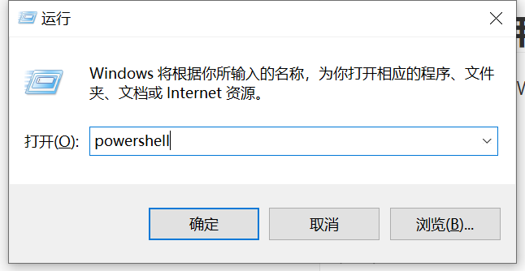
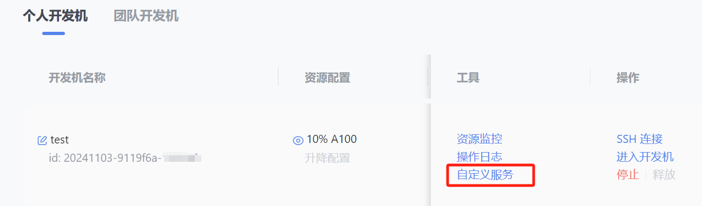
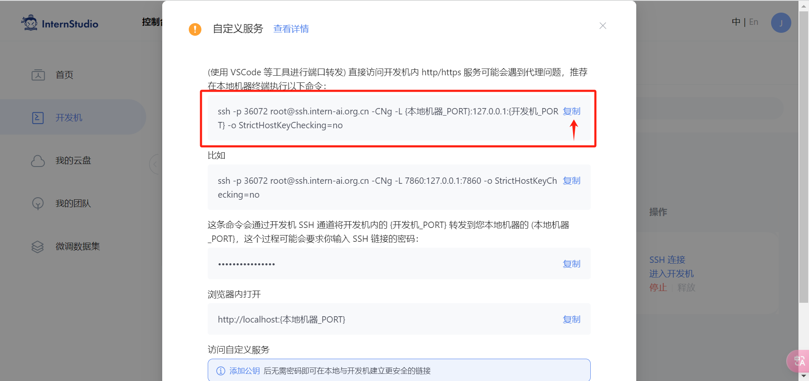
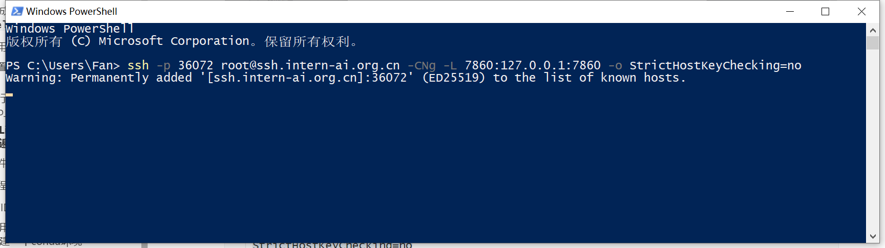
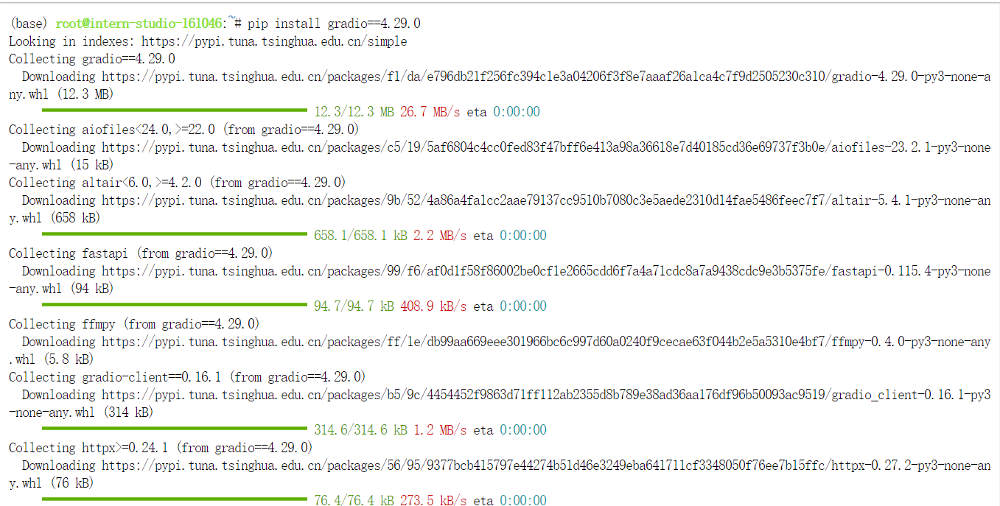
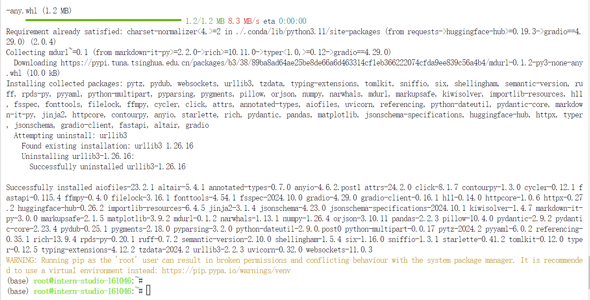
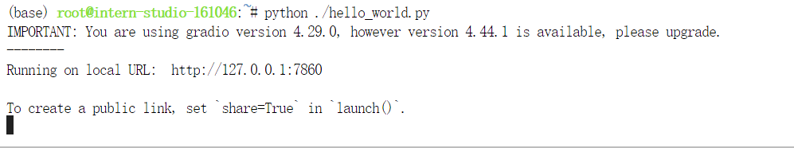
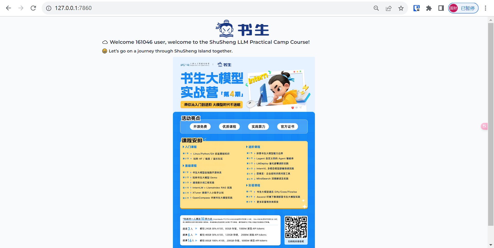

# 一、完成SSH连接与端口映射并运行`hello_world.py`

**SSH**全称Secure Shell，中文翻译为安全外壳，它是一种**网络安全协议**，通过加密和认证机制实现安全的访问和文件传输等业务。SSH 协议通过对网络数据进行加密和验证，在不安全的网络环境中提供了安全的网络服务。

SSH 是（C/S架构）由**服务器**和**客户端**组成，为建立安全的 SSH 通道，双方需要先建立 TCP 连接，然后协商使用的版本号和各类算法，并生成相同的**会话密钥**用于后续的对称加密。在完成用户认证后，双方即可建立会话进行数据交互。

## 1.使用密码进行SSH远程连接

1. 使用Win+R打开运行框，输入powershell，打开powershell终端。

   

   

2. 开发机平台中，进入开发及页面找到创建好的开发机，点击`SSH连接`

   

3. 复制登录命令

   

4. 粘贴到powershell中，回车

   

5. 复制密码

   

6. 粘贴到powershell中，回车

   

   

## 2.配置SSH密钥进行SSH远程连接

1. 使用RSA算法生成密钥，在powershell中输入并运行以下命令（一路回车）

   ```powershell
   ssh-keygen -t rsa
   ```

   

2. 在powershell中输入并运行以下命令查看生成的密钥

   ```powershell
   Get-Content C:\Users\{your_username}/.ssh/id_rsa.pub
   ```

   

3. 在开发及平台首页，点击`配置SSH Key`，并继续点击`添加SSH公钥`

   

   

4. 复制刚刚生成的密钥，粘贴到`公钥`框中，点击立即添加

   

5. 公钥添加成功后，重新复制登录命令通过powershell进行连接，无需密码即可连接成功。

   

   

## 3.进行端口映射并运行`hello_world.py

1.在开发机界面，点击`自定义服务`



2.复制第一条命令



3.修改`{本地机器_PORT}`与`{开发机_PORT}`，在powershell中粘贴并运行

```powershell
ssh -p 36072 root@ssh.intern-ai.org.cn -CNg -L 7860:127.0.0.1:7860 -o StrictHostKeyChecking=no
```



4.开发机中新建`hello_world.py`，并填入代码

```python
import socket
import re
import gradio as gr
 
# 获取主机名
def get_hostname():
    hostname = socket.gethostname()
    match = re.search(r'-(\d+)$', hostname)
    name = match.group(1)
    
    return name
 
# 创建 Gradio 界面
with gr.Blocks(gr.themes.Soft()) as demo:
    html_code = f"""
            <p align="center">
            <a href="https://intern-ai.org.cn/home">
                
            </a>
            </p>
            <h1 style="text-align: center;">☁️ Welcome {get_hostname()} user, welcome to the ShuSheng LLM Practical Camp Course!</h1>
            <h2 style="text-align: center;">😀 Let’s go on a journey through ShuSheng Island together.</h2>
            <p align="center">
                <a href="https://github.com/InternLM/Tutorial/blob/camp3">
                    
                </a>
            </p>

            """
    gr.Markdown(html_code)

demo.launch()
```

5.安装`gradio`依赖

```bash
pip install gradio==4.29.0
```





6.运行`hello_world.py`

```bash
python ./hello_world.py
```



7.本地浏览器访问`http://127.0.0.1:7860`或`http://localhost:7860`




# 二、将Linux基础命令在开发机上完成一遍

## 1.文件管理命令

- 创建文件  `touch`

  ```bash
  touch test.py
  ```

  

- 创建文件夹  `mkdir`

  ```bash
  mkdir test
  ```

  

- 切换目录  `cd`

  ```bash
  cd test
  ```

  

- 显示所在目录  `pwd`

  ```bash
  pwd
  ```

  

- 查看文件内容  `cat`

  ```bash
  cat ~/test.py
  ```

  

- 编辑文件  `vi`或`vim`

  ```bash
  vim ~/test.py
  ```

  

- 复制文件  `cp`

  ```bash
  cp ~/test.py ./
  ```

  

- 创建文件软连接  `ln`

  ```bash
  ln -s ~/test.py ./
  ```

  

- 移动文件  `mv`

  ```bash
  mv ~/test.py ./
  ```

  

- 删除文件  `rm`

  ```bash
  rm test.py
  ```

  

- 删除目录  `rmdir`（只删除空目录）`rm -r`(可删除非空目录)

  ```bash
  cd ~
  rm -rf test/
  ```

  

- 查找文件  `find`

  ```bash
  find ./test/ -name "222"
  ```

  

- 查看文件或目录的详细信息  `ls`

  ```bash
  ls -l ./test/
  ```

  

- 处理文件  `sed`

  ```bash
  echo "Hello World" > 111
  cat 111
  sed -e 's/World/JimFan/g' 111
  ```

  

  

## 2.进程管理命令

- 查看正在运行的进程  `ps`

  ```bash
  ps
  ps aux
  ```

  

- 动态显示正在运行的进程  `top`

  ```bash
  top
  ```

  

- 查看进程树  `pstree`

  ```bash
  pstree
  ```

  开发机缺失这个命令？

  

- 查找进程  `pgrep`

  ```bash
  pgrep -u root
  ```

  

- 更改进程的优先级  `nice`

  ```bash
  nice -n 0 bash
  ```

  

- 显示进程的相关信息  `jobs`

  ```bash
  jobs
  ```

  

- 将进程调入后台  `bg`将挂起的进程放到后台运行  `fg`将后台进程调回前台运行

  ```bash
  bg
  fg
  ```

  

- 杀死进程  `kill`

  ```bash
  kill -9 8
  ```

  

  

  

## 3.NVIDIA系统管理接口命令

- 显示 GPU 状态的摘要信息  `nvidia-smi`

  ```bash
  nvidia-smi
  ```

  

- 显示详细的 GPU 状态信息

  ```bash
  nvidia-smi -l 1
  ```

  

- 显示 GPU 的帮助信息

  ```bash
  nvidia-smi -h
  ```

  

- 列出所有 GPU 并显示它们的 PID 和进程名称

  ```bash
  nvidia-smi pmon
  ```

  

- 强制结束指定的 GPU 进程（GPU ID 为 0 上的 PID 为 1 的进程）

  ```bash
  nvidia-smi --id=0 --ex_pid=1
  ```

  

- 设置 GPU 性能模式

  ```bash
  nvidia-smi -pm 1
  ```

  

- 重启 GPU （ID 为 0 的 GPU）

  ```bash
  nvidia-smi --id=0 -r
  ```

  

# 三、使用 VSCODE 远程连接开发机并创建一个conda环境

## 1.VSCODE SSH新建远程连接


## 2.复制开发机SSH连接命令并粘贴，回车确认


## 3.回车确认配置配件


## 4.远程连接添加完毕


## 5.远程连接开发机


## 6.创建conda虚拟环境test

```bash
conda --version   #查看当前开发机中conda的版本信息

#设置清华镜像
conda config --add channels https://mirrors.tuna.tsinghua.edu.cn/anaconda/pkgs/main
conda config --add channels https://mirrors.tuna.tsinghua.edu.cn/anaconda/pkgs/free
conda config --add channels https://mirrors.tuna.tsinghua.edu.cn/anaconda/pkgs/r
conda config --add channels https://mirrors.tuna.tsinghua.edu.cn/anaconda/pkgs/pro
conda config --add channels https://mirrors.tuna.tsinghua.edu.cn/anaconda/pkgs/msys2

conda create -n test python=3.10   #python版本为3.10、名字为test的虚拟环境
```


## 7.输入`Y`回车


## 8.查看虚拟环境

```bash
conda env list
```


## 9.激活虚拟环境test

```bash
conda activate test
```


## 10.退出虚拟环境test

```bash
conda activate
```


## 11.删除虚拟环境test

```bash
conda remove --name test --all
```


## 12.输入`Y`回车


## 13.查看虚拟环境

```bash
conda env list
```


- [x] **The End.**

