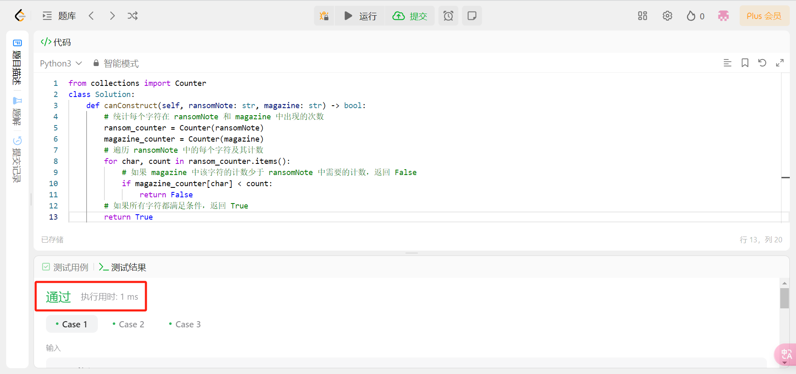
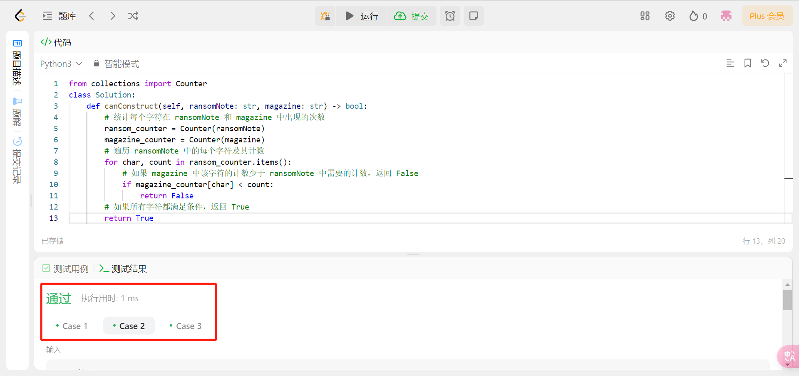
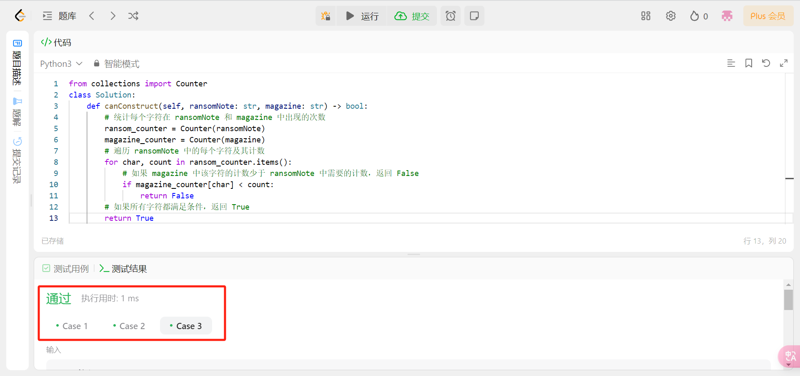
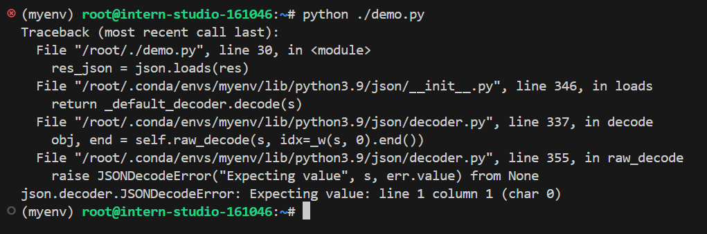
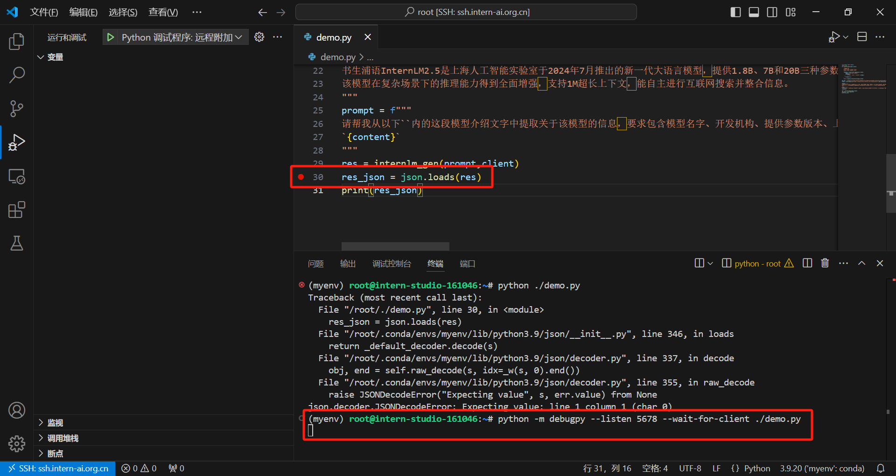
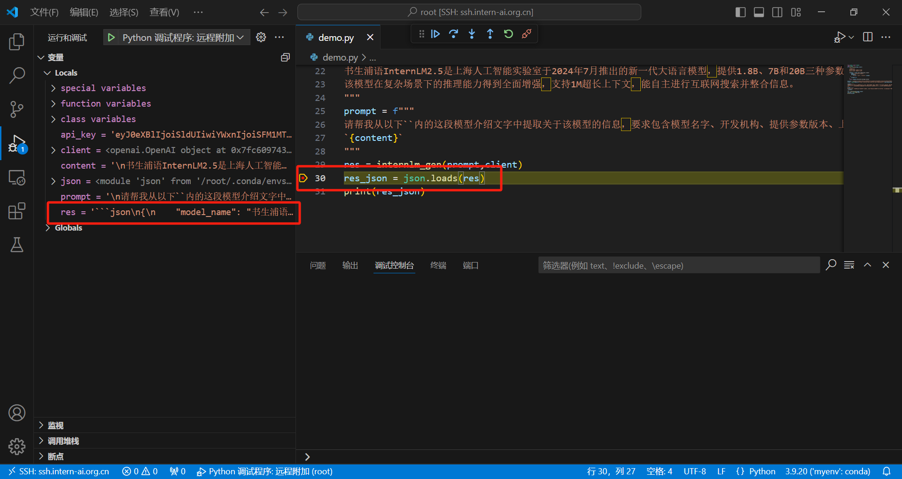
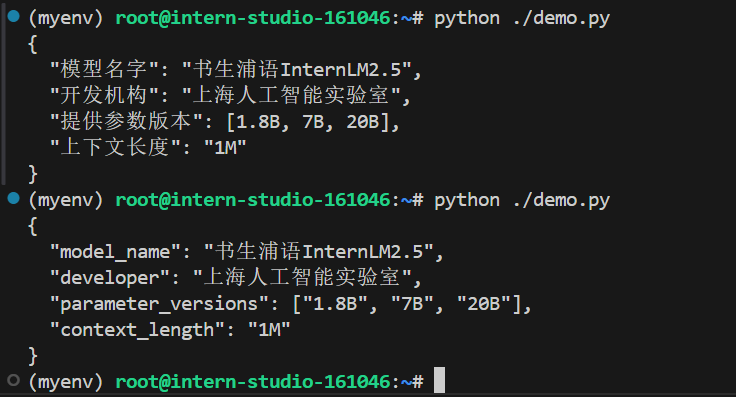
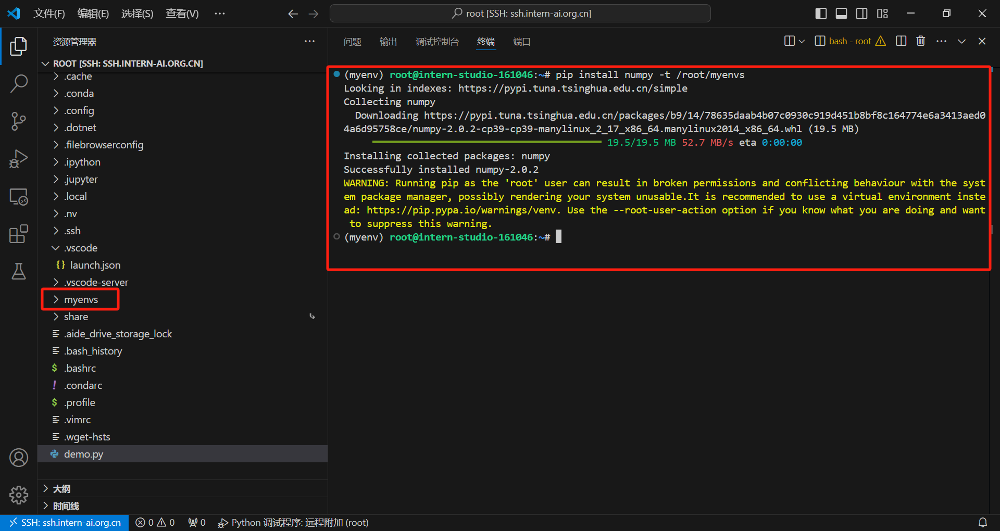
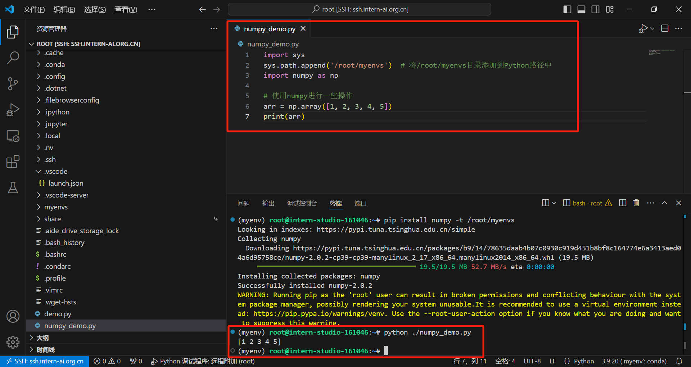

# 一、Leetcode 383

## 1.Python代码

```python
from collections import Counter
class Solution:
    def canConstruct(self, ransomNote: str, magazine: str) -> bool:
        # 统计每个字符在 ransomNote 和 magazine 中出现的次数
        ransom_counter = Counter(ransomNote)
        magazine_counter = Counter(magazine)
        # 遍历 ransomNote 中的每个字符及其计数
        for char, count in ransom_counter.items():
            # 如果 magazine 中该字符的计数少于 ransomNote 中需要的计数，返回 False
            if magazine_counter[char] < count:
                return False
        # 如果所有字符都满足条件，返回 True
        return True
```

## 2.leetcode提交通过截图







# 二、Vscode连接InternStudio debug

## 1.新建`demo.py`文件，编辑内容为作业代码，填入`api_key`

```python
from openai import OpenAI
import json
def internlm_gen(prompt,client):
    '''
    LLM生成函数
    Param prompt: prompt string
    Param client: OpenAI client 
    '''
    response = client.chat.completions.create(
        model="internlm2.5-latest",
        messages=[
            {"role": "user", "content": prompt},
      ],
        stream=False
    )
    return response.choices[0].message.content

api_key = 'xxxxxxxxx'
client = OpenAI(base_url="https://internlm-chat.intern-ai.org.cn/puyu/api/v1/",api_key=api_key)

content = """
书生浦语InternLM2.5是上海人工智能实验室于2024年7月推出的新一代大语言模型，提供1.8B、7B和20B三种参数版本，以适应不同需求。
该模型在复杂场景下的推理能力得到全面增强，支持1M超长上下文，能自主进行互联网搜索并整合信息。
"""
prompt = f"""
请帮我从以下``内的这段模型介绍文字中提取关于该模型的信息，要求包含模型名字、开发机构、提供参数版本、上下文长度四个内容，以json格式返回。
`{content}`
"""
res = internlm_gen(prompt,client)
res_json = json.loads(res)
print(res_json)
```

## 2.运行`demo.py`查看运行情况

```bash
python ./demo.py
```



## 3.分析报错初步定位

​	这个报错是JSON解析器在尝试解析一个字符串时遇到了问题。

​	具体来说，报错信息"Expecting value: line 1 column 1 (char 0)"表示JSON解析器在第一行第一个字符处遇到了一个问题，期望解析一个值，但是找不到有效的JSON值。

​	这种情况通常发生在尝试解析一个空字符串或者非法的JSON格式时。可能的原因包括：

​		1.JSON 字符串为空。

​		2.JSON 字符串格式不正确，缺少必要的键、值对、括号等。

​		3.JSON 字符串可能被截断或损坏，导致无法解析。

​	要解决这个问题，**`首先检查正在解析的JSON字符串，确保其格式正确且完整`**。

```python
res_json = json.loads(res)
```

​	代码中，`res`的值为正在解析的JSON字符串，首先调试判断它的格式是否正确与完整。

## 4.VScode远程调试`demo.py`

打开vscode的运行和调试窗口，在代码第30行处设置断点，终端中输入命令开始远程调试

```bash
python -m debugpy --listen 5678 --wait-for-client ./demo.py 
```



`F5`启动调试，程序运行至断点处自动停止，查看左侧`变量`窗口的内容



通过`变量`窗口可以看到，程序运行至断点处时，`res`的值为：

```json
'```json\n{\n    "model_name": "书生浦语InternLM2.5",\n    "development_institute": "上海人工智能实验室",\n    "parameter_versions": ["1.8B", "7B", "20B"],\n    "maximum_context_length": "1M"\n}\n```'
```

通过字符串可以判断当前`res`的值中有对JSON格式干扰字符`json\n`存在，需要对`res`的值进行修正为JSON的正确格式。

## 5.修改代码

修改前

```python
……

res = internlm_gen(prompt,client)

# 将变量 res 解析为 JSON 对象，并将结果赋值给变量 res_json
res_json = json.loads(res)
print(res_json)
```

修改后

```python
……

res = internlm_gen(prompt,client)

# 将变量 res 中的字符串中的 'json\n' 替换为空，并使用 strip() 方法去除字符串两端的空白字符，然后将结果赋值给变量 res_cleaned
res_cleaned = res.replace('json\n', '').strip()

# 从 res_cleaned 字符串中找到第一个 '{' 和最后一个 '}'，然后提取这两个字符之间的子字符串（包括 '{' 和 '}'），并将结果赋值给变量 res_str
res_str = res_cleaned[res_cleaned.find('{'):res_cleaned.rfind('}') + 1]

# 将变量 res_str 中的字符串转换为 JSON 格式的字符串，并将结果赋值给变量 res_dump
res_dumps = json.dumps(res_str)

# 将变量 res_dumps 解析为 JSON 对象，并将结果赋值给变量 res_json
res_json = json.loads(res_dumps)
print(res_json)
```

## 6.运行修改后`demo.py`查看运行情况

```bash
python ./demo.py
```



问题解决，修改后完整代码如下：

```python
from openai import OpenAI
import json
def internlm_gen(prompt,client):
    '''
    LLM生成函数
    Param prompt: prompt string
    Param client: OpenAI client 
    '''
    response = client.chat.completions.create(
        model="internlm2.5-latest",
        messages=[
            {"role": "user", "content": prompt},
      ],
        stream=False
    )
    return response.choices[0].message.content

api_key = 'xxxxxxxxxxxxxxxxxxxxxxxx'
client = OpenAI(base_url="https://internlm-chat.intern-ai.org.cn/puyu/api/v1/",api_key=api_key)

content = """
书生浦语InternLM2.5是上海人工智能实验室于2024年7月推出的新一代大语言模型，提供1.8B、7B和20B三种参数版本，以适应不同需求。
该模型在复杂场景下的推理能力得到全面增强，支持1M超长上下文，能自主进行互联网搜索并整合信息。
"""
prompt = f"""
请帮我从以下``内的这段模型介绍文字中提取关于该模型的信息，要求包含模型名字、开发机构、提供参数版本、上下文长度四个内容，以json格式返回。
`{content}`
"""
res = internlm_gen(prompt,client)
res_cleaned = res.replace('json\n', '').strip()
res_str = res_cleaned[res_cleaned.find('{'):res_cleaned.rfind('}') + 1]
res_dumps = json.dumps(res_str)
res_json = json.loads(res_dumps)
print(res_json)
```

# 三、使用VScode远程安装numpy到指定文件夹，并在python文件中引用

## 1.使用pip install -t命令安装numpy到/root/myenvs目录下

```bash
pip install numpy -t /root/myenvs
```



## 2.创建一个新的文件`numpy_demo.py`并引用numpy

```python
import sys
sys.path.append('/root/myenvs')  # 将/root/myenvs目录添加到Python路径中
import numpy as np

# 使用numpy进行一些操作
arr = np.array([1, 2, 3, 4, 5])
print(arr)
```

## 3.运行`numpy_demo.py`并查看运行结果

```bash
python ./numpy_demo.py 
```




**The end.**