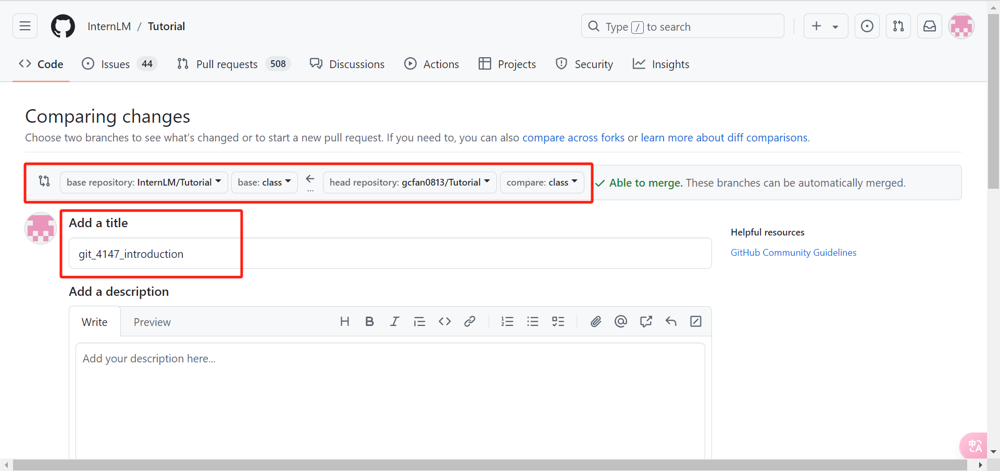

# 一、破冰活动：自我介绍

## 1.将https://github.com/InternLM/Tutorial/tree/camp4项目fork到自己账号下


取消`Copy the camp4 branch only`复选框


## 2.克隆项目到InternStudio本地并切换到class分支

```bash
git clone https://github.com/gcfan0813/Tutorial.git 
cd Tutorial/
git branch -a
git checkout -b class origin/class
```


## 3.切换到`icamp4`目录，新建`uid.md`文件（我的uid：4147）


## 4.编辑`4147.md`内容为自我介绍


## 5.提交更改分支

```bash
git add .
git commit -m "add git_camp4_4147_introduction"
```


## 6.推送分支到远程仓库

```bash
git push origin class
```

> 第一次推送需要登陆GitHub授权


## 7.检查提交内容




## 8.Create pull request


# 二、实践项目：构建个人项目

个人大模型笔记仓库：https://github.com/gcfan0813/InternLM-Study


**The End.**

