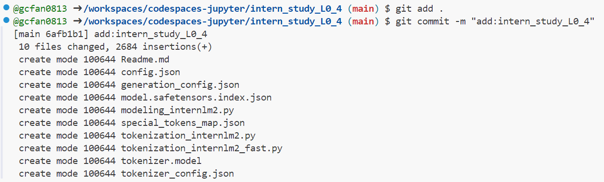

# 一、模型下载(HF)

## 1.创建`Github CodeSpace`


## 2.安装依赖

```bash
pip install transformers==4.38
pip install sentencepiece==0.1.99
pip install einops==0.8.0
pip install protobuf==5.27.2
pip install accelerate==0.33.0
```


## 3.下载`internlm/internlm2_5-7b-chat`配置文件

新建`hf_download_josn.py`文件

```bash
touch hf_download_josn.py
```


编辑文件，填入代码

```python
import os
from huggingface_hub import hf_hub_download

# 指定模型标识符
repo_id = "internlm/internlm2_5-7b-chat"

# 指定要下载的文件列表
files_to_download = [
    {"filename": "config.json"},
    {"filename": "model.safetensors.index.json"},
    {"filename": "generation_config.json"},
    {"filename": "modeling_internlm2.py"},
    {"filename": "special_tokens_map.json"},
    {"filename": "tokenization_internlm2.py"},
    {"filename": "tokenization_internlm2_fast.py"},
    {"filename": "tokenizer.model"},
    {"filename": "tokenizer_config.json"}
]

# 创建一个目录来存放下载的文件
local_dir = f"{repo_id.split('/')[1]}"
os.makedirs(local_dir, exist_ok=True)

# 遍历文件列表并下载每个文件
for file_info in files_to_download:
    file_path = hf_hub_download(
        repo_id=repo_id,
        filename=file_info["filename"],
        local_dir=local_dir
    )
    print(f"{file_info['filename']} file downloaded to: {file_path}")
```


运行`hf_download.jsox.py`，下载模型配置文件

```bash
python hf_download_josn.py
```


## 4.下载`internlm/internlm2_5-1_8b`并打印示例输出

新建`hf_download_1_8_demo.py`，编辑文件代码

```bash
touch hf_download_1_8_demo.py
```

```python
import torch
from transformers import AutoTokenizer, AutoModelForCausalLM

tokenizer = AutoTokenizer.from_pretrained("internlm/internlm2_5-1_8b", trust_remote_code=True)
model = AutoModelForCausalLM.from_pretrained("internlm/internlm2_5-1_8b", torch_dtype=torch.float16, trust_remote_code=True)
model = model.eval()

inputs = tokenizer(["A beautiful flower"], return_tensors="pt")
gen_kwargs = {
    "max_length": 128,
    "top_p": 0.8,
    "temperature": 0.8,
    "do_sample": True,
    "repetition_penalty": 1.0
}

output = model.generate(**inputs, **gen_kwargs)
output = tokenizer.decode(output[0].tolist(), skip_special_tokens=True)
print(output)
```


运行`hf_download_1_8_demo.py`，等待模型下载及运行后输出结果

```bash
python hf_download_1_8_demo.py
```


# 二、模型上传（HF）

## 1.安装`git lfs`

```bash
curl -s https://packagecloud.io/install/repositories/github/git-lfs/script.deb.sh | sudo bash
git lfs install
pip install huggingface_hub
```


## 2.使用`huggingface-cli login`命令进行登录

```bash
git config --global credential.helper store
huggingface-cli login
```


## 3.创建项目`intern_study_L0_4`并clone到本地

```bash
huggingface-cli repo create intern_study_L0_4
git clone https://huggingface.co/gcfan/intern_study_L0_4
```


## 4.复制`internlm/internlm2_5-7b-chat`的配置文件到项目目录

```bash
cd intern_study_L0_4/
cp /workspaces/codespaces-jupyter/internlm2_5-7b-chat/* ./
```


## 5.创建并编辑`Readme.md`文件

```bash
touch Readme.md
```

```markdown
# 书生浦语大模型实战营camp4
- UID:4147
- hugging face模型上传测试
- 更多内容请访问 https://github.com/InternLM/Tutorial/tree/camp4
```


## 6.提交到远程仓库

```bash
git add .
git commit -m "add:intern_study_L0_4"
git push
```




## 7.在`Hugging Face`上查看验证


# 三、Space上传（HF）

## 1.创建Hugging Face Spaces


创建项目名`intern_cobuild`，应用`Static`


创建成功


## 2.clone项目

```bash
git clone https://huggingface.co/spaces/gcfan/intern_cobuild
cd intern_cobuild
```


## 3.修改目录下`index.html`文件代码

```html
<!doctype html>
<html>
<head>
  <meta charset="utf-8" />
  <meta name="viewport" content="width=device-width" />
  <title>My static Space</title>
  <style>
    html, body {
      margin: 0;
      padding: 0;
      height: 100%;
    }
    body {
      display: flex;
      justify-content: center;
      align-items: center;
    }
    iframe {
      width: 430px;
      height: 932px;
      border: none;
    }
  </style>
</head>
<body>
  <iframe src="https://colearn.intern-ai.org.cn/cobuild" title="description"></iframe>
</body>
</html>

```


## 4.push到远程仓库

```bash
git add .
git commit -m "update: colearn page"
git push
```


## 5.刷新Space页面查看效果


**The End.**

